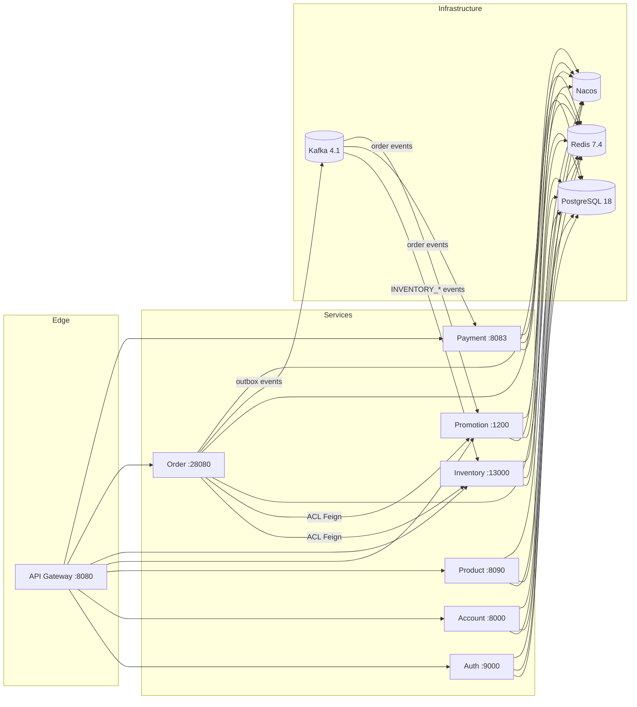

# Tiny Store

[English](README.md) | [简体中文](README.zh-CN.md)

A DDD-style microservices e-commerce platform. Eight deployable services behind an API gateway demonstrate production-grade distributed-system patterns: hexagonal architecture, transactional outbox, payment saga, distributed idempotency, anti-corruption layers, and a canonical inventory reservation state machine.


## Highlights

- 8 deployable microservices + 1 shared infrastructure library, single PostgreSQL database with per-domain schemas
- Hexagonal (ports & adapters) layering in every domain module: `domain / application / infrastructure / interfaces`
- Transactional outbox pattern (order domain → Kafka) with DLT support for reliable event delivery
- Payment saga orchestrated with Spring State Machine
- Redis-based request idempotency at gateway and order layers
- Canonical inventory reservation lifecycle (RFC-001): `PRE_DEDUCTED → CONFIRMED / RELEASED / EXPIRED`
- Feature flags for gradual rollout and dual-write compatibility during migration
- Four-tier testing strategy: unit → Testcontainers IT → black-box E2E → concurrency & load

## Architecture



The gateway routes and authenticates all external traffic. Services talk to each other only through ACL Feign clients (order → inventory, order → promotion); cross-domain state changes flow through Kafka as outbox-published domain events. PostgreSQL is the system of record (one schema per domain), Redis handles idempotency and the high-concurrency inventory pre-deduct gate, and Nacos provides service discovery.

## Services

| Module | Port | Schema | Purpose |
|--------|------|--------|---------|
| `tinystore-domain-gateway` | 8080 | — | Spring Cloud Gateway: routing, JWT auth, IP rate limiting, request idempotency |
| `tinystore-domain-auth` | 9000 | `tinystore_auth` | OTP/password auth, token revocation, consent, client registration |
| `tinystore-domain-account` | 8000 | `tinystore_account` | User accounts, addresses, merchant shops |
| `tinystore-domain-product` | 8090 | `tinystore_product` | Product/SKU catalog, specifications, attributes |
| `tinystore-domain-promotion` | 1200 | `tinystore_promotion` | Coupons, checkout quotes (quote/commit/release), budget monitoring |
| `tinystore-domain-inventory` | 13000 | `tinystore_inventory` | Reservation lifecycle, stock management, Redis pre-deduct gateway |
| `tinystore-domain-order` | 28080 | `tinystore_order` | Trade/order creation, payment saga, fulfillment, outbox events |
| `tinystore-domain-payment` | 8083 | `tinystore_payment` | Payment orders, refunds, notification retry |
| `tinystore-library-infrastructure` | — | — | Shared: Redis/Redisson, Kafka constants, Feign clients, JSON utils, security auto-config |

## Key Patterns

**Hexagonal architecture** — every domain module follows the same internal layering: `domain` (aggregates, domain services, repository ports), `application` (use-case orchestration), `infrastructure` (JPA persistence, ACL Feign clients, outbox/Kafka, schedulers), `interfaces` (REST controllers). Domain logic never depends on frameworks or other services.

**Transactional outbox** — order-domain writes are committed to the `outbox_event` table in the same transaction as the business write. `OutboxEventPublisherScheduler` polls and publishes to Kafka; failed deliveries land on a DLT. This guarantees at-least-once delivery without distributed transactions.

**Payment saga** — the order lifecycle (create → pay → confirm → fulfill → receipt) is orchestrated by a Spring State Machine; payment confirm/cancel drives inventory confirm/release through the event chain.

**Idempotency** — all critical mutating endpoints require an `Idempotency-Key` header. The order domain backs it with Redis (`IdempotencyService`); the gateway has a separate service with a local Caffeine fallback.

**Anti-corruption layer (ACL)** — inter-service calls use Feign clients under `infrastructure/acl/` (`InventoryClient`, `PromotionClient`) with per-domain DTO duplication, isolating each service from its neighbors' models.

**Feature flags** — gradual rollout via `@Value` / `@ConditionalOnProperty` (e.g. `order.inventory.use-canonical-reservation-api`, `inventory.reservation.canonical-enabled`), enabling dual-write compatibility and zero-downtime migration.

**Inventory reservation state machine (RFC-001)** — `inventory_reservation` is the single authority for the inventory lifecycle; Redis is a non-authoritative concurrency gate only. Lifecycle: `PRE_DEDUCTED → CONFIRMED` (payment success, terminal), `PRE_DEDUCTED → RELEASED` (cancel, terminal), `PRE_DEDUCTED → EXPIRED` (scheduler, terminal). `CONFIRMED → RELEASED` is forbidden — returns must go through after-sale/refund. See [RFC-001](docs/rfcs/RFC-001-canonical-inventory-reservation.md).

## Getting Started

Prerequisites: Docker, JDK 17 (Maven wrapper is included).

```bash
make debug    # build + start all 8 services and PostgreSQL/Redis/Kafka/Nacos
```

Wait for the gateway health check, then use the API via `http://localhost:8080`:

```bash
curl http://localhost:8080/actuator/health
```

| Service / Infra | Address |
|-----------------|---------|
| Gateway | http://localhost:8080 |
| Auth | http://localhost:9000 |
| Account | http://localhost:8000 |
| Product | http://localhost:8090 |
| Promotion | http://localhost:1200 |
| Inventory | http://localhost:13000 |
| Order | http://localhost:28080 |
| Payment | http://localhost:8083 |
| Nacos console | http://localhost:8848/nacos (nacos/nacos) |
| PostgreSQL | localhost:5432 |
| Redis | localhost:6379 |
| Kafka | localhost:9092 |

Stop the environment with `make down` (use `MODE=test make down` for the test environment).

## Testing

| Command | What it runs |
|---------|--------------|
| `make build` | Clean Maven build, tests skipped |
| `make unit` | Unit tests only (mocked deps, no Docker) |
| `make it` | Integration tests with Testcontainers (PostgreSQL, Kafka) |
| `make e2e` | Black-box API tests against the compose stack through the gateway |
| `make e2e-smoke` | Health-check-only E2E (gateway + all service routes) |
| `make test` | Full suite sequentially: unit → IT → E2E |
| `make consistency` | 200-concurrent-request consistency tests with DB assertions |
| `make load` | k6 load test (p95/p99 latency metrics) |
| `make load-min` | Order-link peak scan on the minimal 7-container stack (multi-VUS, warmup + first-level discard) |
| `make load-min-nokafka` | Same as load-min without Kafka (pure-sync probe) |
| `make load-matrix` | Full-stack k6 load matrix (multi-VUS, per-level SKU, one clear result line per level) |
| `make load-matrix-it` | Consistency matrix (oversell / idempotency / confirm at multiple concurrency levels + strong DB assertions) |

Load-test results and methodology live under [`docs/performance/`](docs/performance/), architecture notes under [`docs/architecture/`](docs/architecture/).

## License

MIT — see [LICENSE](LICENSE).
