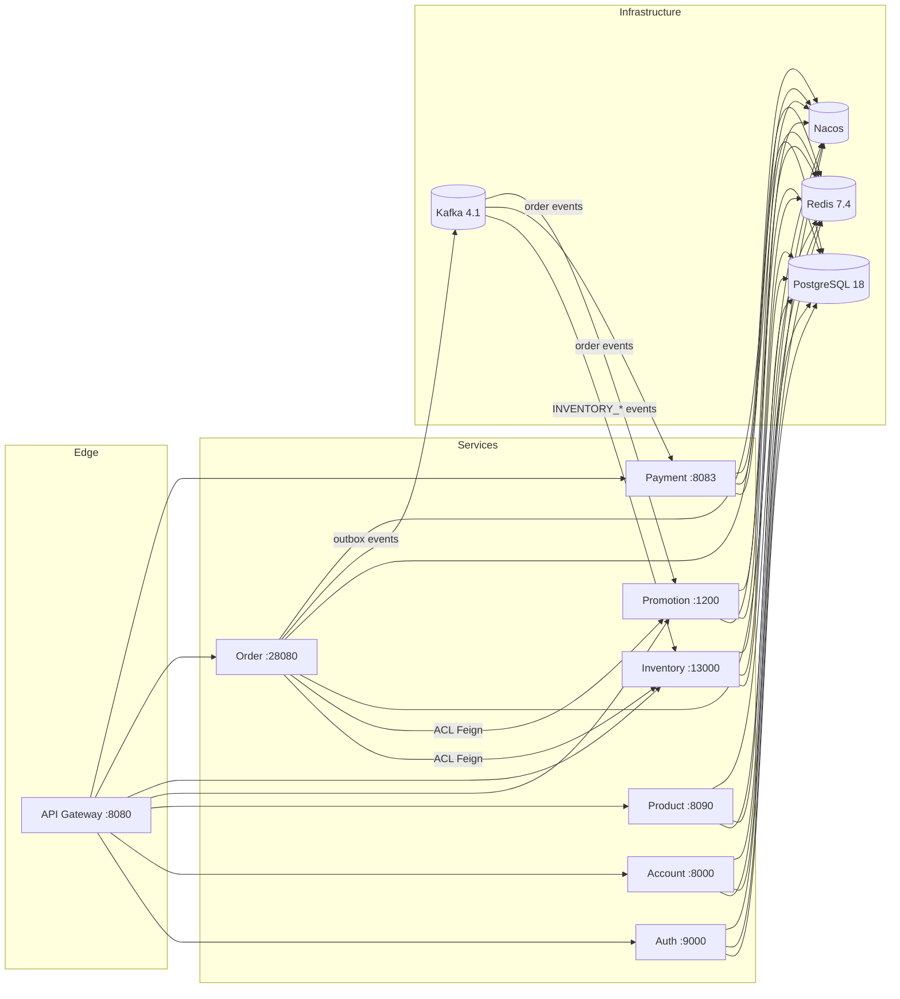

# Tiny Store

[English](README.md) | [简体中文](README.zh-CN.md)

一个 DDD 风格的微服务电商平台。API 网关之后是 8 个可部署服务，展示了生产级分布式系统模式：六边形架构、事务性 Outbox、支付 Saga、分布式幂等、防腐层（ACL）以及规范化的库存预扣状态机。


## 核心亮点

- 8 个可部署微服务 + 1 个共享基础设施库，单一 PostgreSQL 数据库、按领域分 schema
- 每个领域模块采用六边形（端口与适配器）分层：`domain / application / infrastructure / interfaces`
- 事务性 Outbox 模式（订单域 → Kafka），带 DLT，保证事件可靠投递
- 基于 Spring State Machine 编排的支付 Saga
- 网关与订单层基于 Redis 的请求幂等
- 规范化库存预扣生命周期（RFC-001）：`PRE_DEDUCTED → CONFIRMED / RELEASED / EXPIRED`
- 特性开关支持渐进式灰度与迁移期双写兼容
- 四层测试策略：单元 → Testcontainers 集成 → 黑盒 E2E → 并发与压测

## 架构总览



网关负责所有外部流量的路由与认证。服务之间只通过 ACL Feign 客户端通信（订单 → 库存、订单 → 促销）；跨领域的状态变更通过 Outbox 发布到 Kafka 的领域事件流动。PostgreSQL 是系统记录源（每个领域一个 schema），Redis 承担幂等与高并发库存预扣网关，Nacos 提供服务发现。

## 服务模块

| 模块 | 端口 | Schema | 职责 |
|--------|------|--------|---------|
| `tinystore-domain-gateway` | 8080 | — | Spring Cloud Gateway：路由、JWT 认证、IP 限流、请求幂等 |
| `tinystore-domain-auth` | 9000 | `tinystore_auth` | OTP/密码认证、令牌吊销、授权同意、客户端注册 |
| `tinystore-domain-account` | 8000 | `tinystore_account` | 用户账号、地址、商家店铺 |
| `tinystore-domain-product` | 8090 | `tinystore_product` | 商品/SKU 目录、规格、属性 |
| `tinystore-domain-promotion` | 1200 | `tinystore_promotion` | 优惠券、结算报价（quote/commit/release）、预算监控 |
| `tinystore-domain-inventory` | 13000 | `tinystore_inventory` | 预扣生命周期、库存管理、Redis 预扣网关 |
| `tinystore-domain-order` | 28080 | `tinystore_order` | 交易/订单创建、支付 Saga、履约、Outbox 事件 |
| `tinystore-domain-payment` | 8083 | `tinystore_payment` | 支付单、退款、通知重试 |
| `tinystore-library-infrastructure` | — | — | 共享：Redis/Redisson、Kafka 常量、Feign 客户端、JSON 工具、安全自动配置 |

## 核心架构模式

**六边形架构** — 每个领域模块遵循相同的内部分层：`domain`（聚合、领域服务、仓储端口）、`application`（用例编排）、`infrastructure`（JPA 持久化、ACL Feign 客户端、Outbox/Kafka、调度器）、`interfaces`（REST 控制器）。领域逻辑不依赖框架或其他服务。

**事务性 Outbox** — 订单域的写入与 `outbox_event` 表在同一个事务内提交。`OutboxEventPublisherScheduler` 轮询并发布到 Kafka，投递失败进入 DLT。在无分布式事务的前提下保证至少一次投递。

**支付 Saga** — 订单生命周期（下单 → 支付 → 确认 → 履约 → 收货）由 Spring State Machine 编排；支付确认/取消通过事件链驱动库存的确认/释放。

**幂等** — 所有关键写操作端点要求携带 `Idempotency-Key` 请求头。订单域用 Redis 实现（`IdempotencyService`）；网关另有独立实现，带本地 Caffeine 兜底。

**防腐层（ACL）** — 服务间调用使用 `infrastructure/acl/` 下的 Feign 客户端（`InventoryClient`、`PromotionClient`），DTO 按领域各自复制，隔离各服务的数据模型。

**特性开关** — 通过 `@Value` / `@ConditionalOnProperty` 渐进灰度（如 `order.inventory.use-canonical-reservation-api`、`inventory.reservation.canonical-enabled`），支持迁移期双写兼容与零停机升级。

**库存预扣状态机（RFC-001）** — `inventory_reservation` 是库存生命周期的唯一权威；Redis 仅作为非权威的并发闸门。生命周期：`PRE_DEDUCTED → CONFIRMED`（支付成功，终态）、`PRE_DEDUCTED → RELEASED`（取消，终态）、`PRE_DEDUCTED → EXPIRED`（调度器触发，终态）。`CONFIRMED → RELEASED` 被禁止——退货必须走售后/退款流程。详见 [RFC-001](docs/rfcs/RFC-001-canonical-inventory-reservation.md)。

## 快速开始

前置条件：Docker、JDK 17（仓库已包含 Maven wrapper）。

```bash
make debug    # 构建并启动全部 8 个服务及 PostgreSQL/Redis/Kafka/Nacos
```

等待网关健康检查通过后，通过 `http://localhost:8080` 访问 API：

```bash
curl http://localhost:8080/actuator/health
```

| 服务 / 基础设施 | 地址 |
|-----------------|---------|
| 网关 Gateway | http://localhost:8080 |
| Auth | http://localhost:9000 |
| Account | http://localhost:8000 |
| Product | http://localhost:8090 |
| Promotion | http://localhost:1200 |
| Inventory | http://localhost:13000 |
| Order | http://localhost:28080 |
| Payment | http://localhost:8083 |
| Nacos 控制台 | http://localhost:8848/nacos（nacos/nacos） |
| PostgreSQL | localhost:5432 |
| Redis | localhost:6379 |
| Kafka | localhost:9092 |

停止环境用 `make down`（测试环境用 `MODE=test make down`）。

## 测试

| 命令 | 内容 |
|---------|--------------|
| `make build` | 干净 Maven 构建（跳过测试） |
| `make unit` | 纯单元测试（mock 依赖，不需要 Docker） |
| `make it` | Testcontainers 集成测试（PostgreSQL、Kafka） |
| `make e2e` | 基于 compose 栈、经网关的黑盒 API 测试 |
| `make e2e-smoke` | 仅健康检查的 E2E（网关 + 全部服务路由） |
| `make test` | 完整测试套件依次执行：单元 → 集成 → E2E |
| `make consistency` | 200 并发请求一致性测试 + DB 断言 |
| `make load` | k6 压测（p95/p99 延迟指标） |

压测结果与方法论见 [`docs/performance/`](docs/performance/)，架构笔记见 [`docs/architecture/`](docs/architecture/)。

## 许可证

MIT — 见 [LICENSE](LICENSE)。
