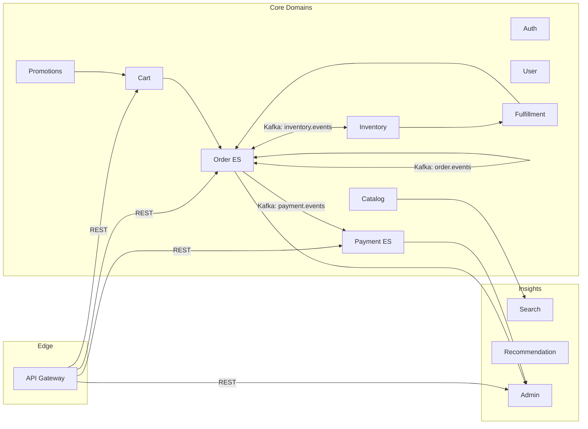

# 架构总览（Overview）

本文给出 Tiny Store 的系统级视图、同步/异步边界、一致性模型与 SLO 口径。配合分册阅读：Saga、领域（Order/Payment/Inventory）、消息规范、可观测与运维。

## 上下文与交互（Context Map）

## 同步/异步边界
- 同步：用户发起的读/写（购物车变更、下单提交、创建支付意图）。
- 异步：跨域状态推进（库存预占/提交、支付成功/失败、出库配送）。

## 一致性模型
- 聚合内：单写者语义 + 乐观并发，强一致。
- 跨上下文：事件驱动最终一致，Outbox + 幂等消费者，允许短暂投影延迟。

## SLO 口径（样例）
- Checkout p95 < 300ms（不含支付跳转）。
- 商品详情 p95 < 120ms。
- 支付回调处理 p95 < 500ms。
- 可用性 99.9%。

## 参考
- 事件信封：`../messaging/event-envelope.md`
- 主题与分区：`../messaging/event-topics.md`
- Checkout 编排：`./saga-checkout.md`
