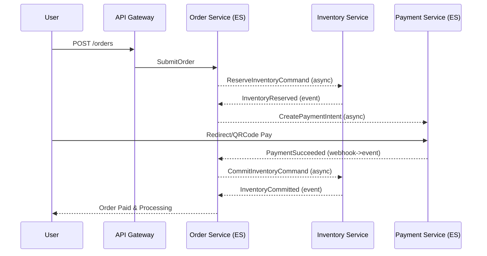

# Checkout 编排（Saga）

描述从下单提交到支付完成/超时取消的编排流程、超时与补偿策略、关键幂等点。

## 成功路径（时序图）

## 失败/超时路径
- 预占失败：O 接收 `InventoryReservationFailed` → 订单取消。
- 支付失败/回调超时：O 接收 `PaymentFailed|Timeout` → 订单取消 → `ReleaseReservation`。
- 预占 TTL 到期：I 发出 `ReservationExpired` → O 取消订单。

## 超时与窗口对齐
- 预占 TTL = 支付时窗（建议 15 分钟，可通过配置统一）。
- Orchestrator 维护超时计时器，逾期自动触发取消路径。

## 幂等交互点
- 命令：`commandId` 去重（Order、Inventory）。
- 回调：`deliveryId/channel` 去重（Payment）。
- 事件：`eventId` 去重（消费者 offset/去重表）。

## 参考
- 订单 ES：`../domain/order-es.md`
- 支付 ES：`../domain/payment-es.md`
- 库存预占：`../domain/inventory-reservation.md`
