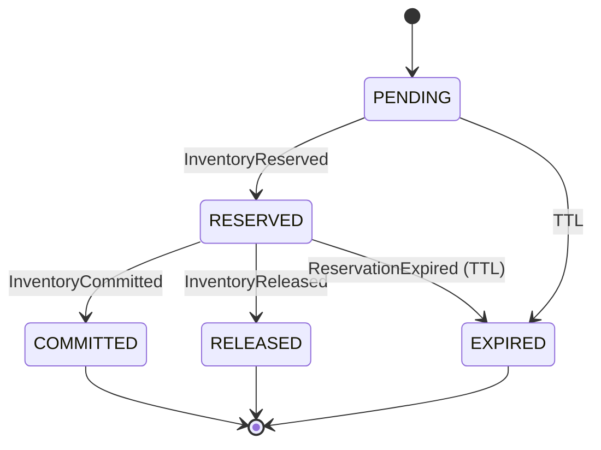

# 库存与预占（TTL + 单分区单写）

覆盖：聚合、不变式、状态机、命令与事件、TTL 扫尾、热门 SKU、指标与引用。

## 聚合与不变式
- InventoryItem(sku, warehouse)：`onHand`, `available`, `reserved`, `committed`；
- Reservation(reservationId, orderId, qty, expires_at, state)：PENDING|RESERVED|COMMITTED|RELEASED|EXPIRED；
- 不变式：`available ≥ 0`；`available + reserved + committed = onHand`。

## 状态机（Reservation）

## 命令与事件
- ReserveInventoryCommand(orderId, skuId, qty, ttl) → InventoryReserved | InventoryReservationFailed
- CommitInventoryCommand(reservationId) → InventoryCommitted
- ReleaseReservationCommand(reservationId, reason) → InventoryReleased
- 后台 TTL Sweeper → ReservationExpired

## 分区与单写
- `inventory-commands` 按 skuId 分区；同一 skuId 串行处理，保障顺序与计数一致；
- 单聚合/单分区写保护“不能超卖”。

## TTL 扫尾
- 扫描即将过期或已过期 Reservation，批量推进 EXPIRED 并回滚 available；
- 与 Orchestrator 对齐支付时窗（同一 TTL）；
- 指标与窗口：控制批量大小与节流，避免冲击热分区。

## 热门 SKU（秒杀）
- Redis 预库存 key：`prestock:sku:{id}`；原子预扣发放令牌；
- 令牌成功者入 Kafka 排队→`inventory-commands`；DB 单写校正真实库存；
- 失败补偿：令牌回滚、纠偏事件与对账表。

## 并发与幂等
- 命令幂等：`commandId` 去重（Reserve/Commit/Release）；
- 分区内顺序：避免重复扣减；
- 事件消费者幂等：以 `(reservationId)` 或 `eventId` 去重。

## 指标
- `reservation_latency_ms`：从 Reserve 到 Reserved 延迟；
- `sweeper_lag`：TTL 扫尾滞后；
- `hot_sku_token_queue_depth`：热 SKU 令牌队列深度；
- `inventory_invariants_violations_total`：守恒校验告警。

## 参考
- 状态映射：`./order-payment-inventory-status-mapping.md`
- Saga：`../architecture/saga-checkout.md`
- SQL：`../reference/sql/inventory-ddl.sql`
