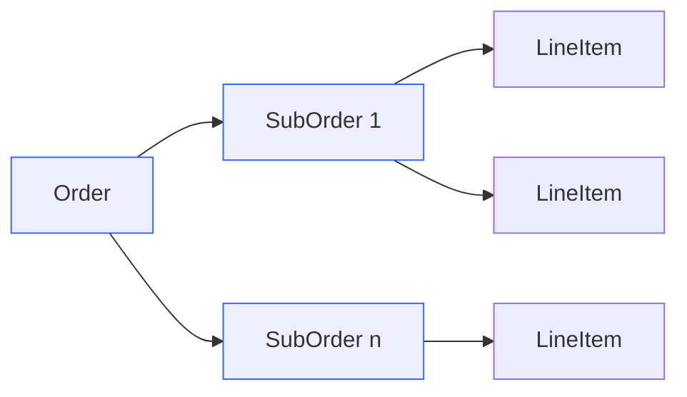
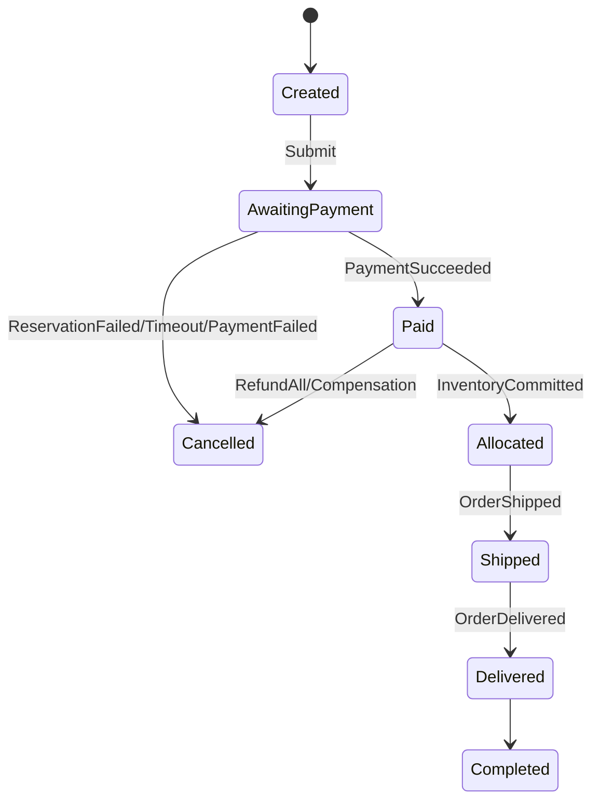

# 订单域（Event Sourcing + CQRS）

本章覆盖：聚合与不变式、事件版本化、快照策略、并发与幂等、读模型与重建，并与库存/支付的状态推进对齐。

## 聚合与不变式
- 聚合：Order(root)、SubOrder、LineItem、Money。
- 不变式：总额 = Σ行 − 折扣；金额非负；状态单调：Created→AwaitingPayment→Paid→Allocated→Shipped→Delivered→Completed/Cancelled。

### 聚合关系（示意）

## 事件（版本化）

### 订单服务发布的事件 (Emitted by Order Service)
以下事件由订单服务发布到 `order.events` 主题：

- **OrderCreated**：订单创建（聚合根初始化）
- **OrderLineAdded/Removed**：订单行项目增删
- **OrderSubmitted**：订单提交（用户确认下单）
- **OrderCancelled**：订单取消
- **OrderShipped**：订单发货
- **OrderDelivered**：订单妥投
- **OrderCompleted**：订单完成
- **AfterSaleApplied**：售后申请
- **AfterSaleApproved**：售后审批通过

### 订单服务消费的事件 (Consumed from Other Domains)
订单服务消费来自其他领域的事件以推进 Saga 流程：

- **PaymentSucceeded** (from payment.events)：支付成功，推进订单到 Paid 状态
- **PaymentFailed** (from payment.events)：支付失败，触发订单取消流程
- **InventoryReserved** (from inventory.events)：库存预占成功，推进到 Allocated 状态
- **InventoryReservationFailed** (from inventory.events)：库存预占失败，触发订单取消
- **InventoryCommitted** (from inventory.events)：库存提交确认
- **InventoryReleased** (from inventory.events)：库存释放确认
- **RefundSucceeded** (from payment.events)：退款成功确认

### 发布的命令 (Published Commands)
订单服务向其他领域发布命令：

- **ReserveInventoryCommand** (to inventory.commands)：请求预占库存
- **CommitInventoryCommand** (to inventory.commands)：请求提交库存
- **ReleaseInventoryCommand** (to inventory.commands)：请求释放库存
- **CreatePaymentIntentCommand** (to payment.commands)：创建支付意图
- **ProcessRefundCommand** (to payment.commands)：处理退款请求
- 元数据：`schemaVersion`、`traceId`、`producerService`（详见 `../messaging/event-envelope.md`）。
- Upcaster：事件 schema 变更以 schemaVersion 升级，保持向后兼容。

## 状态机（核心流）

## 快照策略
- 频率：每 100 个事件或 15 分钟生成快照；
- 恢复：重放优先加载最近快照，再增量重放；
- 存储：`order_snapshots`，包含 `aggregate_id, version, state_json, created_at`。

## 并发与幂等
- 事件存储：append-only，唯一 `(aggregate_id, version)`；命令侧基于版本检查；
- 幂等：对外 `X-Idempotency-Key` → 内部 `commandId` 映射；回调与事件参见 `../architecture/saga-checkout.md` 的幂等交互点。

## 读模型与投影
- 视图：`order_summary`（列表/分页）、`order_timeline`（状态时间轴）；
- 投影运行器：Kafka 消费者 + `projection_offset`（`projection_name, topic, partition, offset`）；
- 查询：见 `../readmodels/order-summary.md` 与 `../readmodels/order-timeline.md`。

## 重建与回放
- 起点：从最近快照；策略：幂等 upsert；
- 过程观测：`projection_lag`、回放速率；
- 风险控制：回放窗口与影响面评估，详见 `../playbooks/outbox-and-projection-replay.md`。

## 与其他域的耦合
- 库存：预占成功推进到支付；支付成功后提交库存；
- 支付：成功/失败/超时决定订单向 Paid/Cancelled 分叉；
- 详见状态映射：`./order-payment-inventory-status-mapping.md` 与 Checkout 编排：`../architecture/saga-checkout.md`。

## 参考
- 订单状态机设计（历史）：`../order/state-machine-design.md`
- Checkout 编排：`../architecture/saga-checkout.md`
