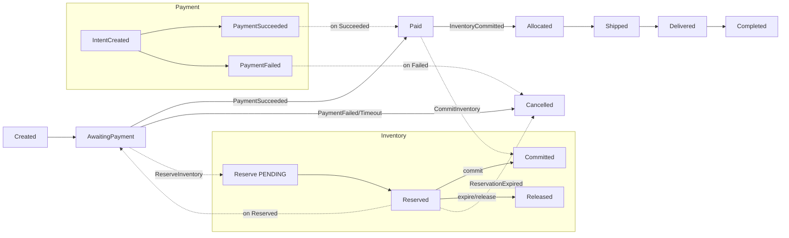

# 订单-支付-库存 状态映射

本文对齐三域状态推进与补偿路径：成功、失败、超时。

## 全局映射图

## 边界情形与补偿
- 支付成功但提交库存失败：保持 Paid，重试提交或人工补偿；避免重复扣减（命令幂等）。
- 预占过期后支付才成功：拒绝推进，触发退款（Payment→RefundRequested）；订单取消。
- 重复回调：依赖 idempotency store 去重，拒绝二次副作用。

## 幂等与重试点
- 命令：`commandId` 去重（Reserve/Commit/Release）。
- 回调：`deliveryId/channel` 去重，签名校验后落库。
- 事件：`eventId` 去重，DLQ 回放遵循幂等。

## 参考
- Saga：`../architecture/saga-checkout.md`
- 库存：`./inventory-reservation.md`
- 支付：`./payment-es.md`