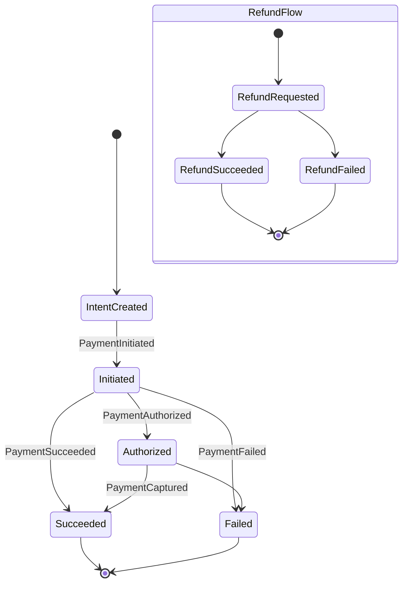

# 支付域（Event Sourcing + CQRS）

覆盖聚合/事件、状态机、回调幂等、读模型与对账、失败与退款处理、指标与引用。

## 聚合
- PaymentIntent：意图（orderId, channel, amount, currency, idempotencyKey, status）。
- PaymentTransaction：与网关交互的交易快照/记录（txnId, status, rawPayload）。
- Refund：退款请求与执行状态（amount, reason, status）。

## 状态机（支付与退款）

说明：部分渠道不区分 Authorized/Captured，直接 Succeeded。

## 事件（版本化）
- PaymentIntentCreated, PaymentInitiated, PaymentAuthorized, PaymentSucceeded, PaymentCaptured, PaymentFailed, RefundRequested, RefundSucceeded, RefundFailed, Reconciled。
- 元数据：`schemaVersion`、`traceId`、`producerService`（见 `../messaging/event-envelope.md`）；支持 Upcaster。

## 回调与幂等
- 网关回调字段映射：以渠道 deliveryId（如 out_trade_no/transaction_id）与 `channel` 组合为幂等键。
- 验签成功后入事件流；重复回调以 idempotency 表拒绝副作用。
- 存储：`payment_idempotency(idempotency_key, response_hash, created_at)`（示例 DDL 见 `../reference/sql/payment-events-ddl.sql`）。

## 读模型与对账
- `payment_status_view`：支付状态追踪（订单页/售后页用）；
- `reconciliation_view`：对账明细（对齐网关账单，差异出具工单）。
- 对账流程：
	- 日批拉取渠道账单 → 写入临时表 → 匹配 `payment_events` 聚合状态；
	- 产生差异事件（缺失回调/金额不符/重复支付）→ 人工工单或自动补单。

## 并发与幂等
- 创建意图：`X-Idempotency-Key` → 内部 `idempotencyKey`；相同键返回同一意图；
- 回调：以 deliveryId/channel 去重；
- 命令：`commandId` 去重（重试安全）。

## 错误与补偿
- 失败/超时：发布 PaymentFailed；订单侧走取消 + 释放预占；
- 回调乱序：以版本与最终态覆盖，读模型按 upsert 幂等；
- 成功但订单提交库存失败：保持支付 Succeeded，订单侧重试 commit 或人工补偿。

## 指标
- `payment_callback_latency_ms`：回调到达到处理完成延迟；
- `webhook_idempotent_hit`：回调重复率；
- `payment_reconcile_gap_minutes`：账单对齐滞后；
- `payment_status_succeeded_total`/`failed_total`：分渠道统计。

## 参考
- Checkout 编排：`../architecture/saga-checkout.md`
- 读模型：`../readmodels/payment-status.md`
- SQL：`../reference/sql/payment-events-ddl.sql`
