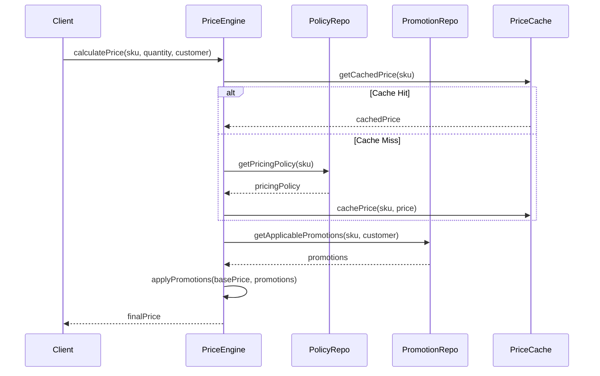

# 价格与促销领域设计

## 概述

价格与促销领域负责管理商品定价策略、促销活动设计、以及动态价格计算。该领域与订单、库存、支付等核心领域紧密协作，确保价格一致性和促销规则的正确执行。

## 核心概念

### 价格体系

```
Price Hierarchy:
├── BasePrice (基础价格)          # 商品原始定价
├── TierPrice (阶梯价格)          # 批量购买折扣
├── CustomerGroupPrice (会员价)    # 不同客户群体价格
└── DynamicPrice (动态价格)       # 实时计算价格
```

### 促销类型

#### 直接折扣类
- **百分比折扣**: `percentage_off`
- **固定金额减免**: `amount_off` 
- **满减优惠**: `threshold_discount`
- **阶梯满减**: `tiered_discount`

#### 组合促销类
- **买N送M**: `buy_x_get_y`
- **套装优惠**: `bundle_discount`
- **第二件半价**: `second_item_half_price`

#### 条件促销类
- **满件折扣**: `quantity_discount`
- **满额免邮**: `free_shipping`
- **会员专享**: `member_exclusive`
- **新用户专享**: `new_customer_only`

## 聚合设计

### PricingPolicy 聚合

```java
public class PricingPolicy {
    private PolicyId policyId;
    private SkuId skuId;
    private TenantId tenantId;
    private List<PriceRule> priceRules;
    private ValidityPeriod validityPeriod;
    private PolicyStatus status;
    
    public Price calculatePrice(PriceContext context) {
        // 价格计算逻辑
    }
}
```

**管理的业务规则:**
- 基础价格设置与更新
- 阶梯价格配置（数量阶梯）
- 会员群体价格差异化
- 价格生效时间与失效机制

### Promotion 聚合

```java
public class Promotion {
    private PromotionId promotionId;
    private TenantId tenantId;
    private PromotionType type;
    private List<PromotionRule> rules;
    private UsageLimit usageLimit;
    private ValidityPeriod validityPeriod;
    private PromotionStatus status;
    
    public DiscountResult applyTo(Cart cart, Customer customer) {
        // 促销应用逻辑
    }
}
```

**管理的业务规则:**
- 促销活动创建与配置
- 促销条件验证（用户、时间、商品范围）
- 促销使用次数限制
- 促销优先级与叠加规则

### PromotionUsage 聚合

```java
public class PromotionUsage {
    private UsageId usageId;
    private PromotionId promotionId;
    private CustomerId customerId;
    private OrderId orderId;
    private UsageTimestamp timestamp;
    private DiscountAmount discountAmount;
    
    public boolean canUseAgain(UsageLimit limit) {
        // 使用次数验证
    }
}
```

## 事件设计

### 发出事件

#### 价格相关事件
```yaml
PricePolicyCreated:
  fields:
    - policyId: PolicyId
    - skuId: SkuId
    - tenantId: TenantId
    - priceRules: List<PriceRule>
    - validFrom: Timestamp
    - validTo: Timestamp

PricePolicyUpdated:
  fields:
    - policyId: PolicyId
    - oldPriceRules: List<PriceRule>
    - newPriceRules: List<PriceRule>
    - updatedAt: Timestamp

BasePrice Changed:
  fields:
    - skuId: SkuId
    - tenantId: TenantId
    - oldPrice: Money
    - newPrice: Money
    - effectiveAt: Timestamp
```

#### 促销相关事件
```yaml
PromotionCreated:
  fields:
    - promotionId: PromotionId
    - tenantId: TenantId
    - type: PromotionType
    - rules: List<PromotionRule>
    - validityPeriod: ValidityPeriod
    - usageLimit: UsageLimit

PromotionActivated:
  fields:
    - promotionId: PromotionId
    - activatedAt: Timestamp
    - activatedBy: UserId

PromotionUsed:
  fields:
    - usageId: UsageId
    - promotionId: PromotionId
    - customerId: CustomerId
    - orderId: OrderId
    - discountAmount: Money
    - usedAt: Timestamp

PromotionExpired:
  fields:
    - promotionId: PromotionId
    - expiredAt: Timestamp
    - reason: ExpirationReason
```

### 消费事件

#### 来自 Order 领域
- `OrderItemAdded` → 触发价格计算
- `CartUpdated` → 重新应用促销规则
- `OrderConfirmed` → 记录促销使用

#### 来自 Inventory 领域  
- `SkuCreated` → 初始化价格策略
- `SkuDeactivated` → 停用相关促销

#### 来自 Account 领域
- `CustomerGroupChanged` → 更新客户价格等级

## 价格计算引擎

### 计算流程



### 价格计算规则

1. **基础价格确定**
   - 查找 SKU 基础价格
   - 应用客户群体价格差异
   - 应用数量阶梯折扣

2. **促销叠加计算**
   - 筛选适用促销活动
   - 按优先级排序促销规则
   - 计算最优促销组合

3. **价格边界检查**
   - 最低价格保护
   - 亏损价格告警
   - 异常价格熔断

## 缓存策略

### 价格缓存

```yaml
Price Cache Key: "price:{tenantId}:{skuId}:{customerGroup}"
TTL: 300 seconds
Invalidation Triggers:
  - PricePolicyUpdated
  - PromotionActivated/Deactivated
  - CustomerGroupChanged
```

### 促销缓存

```yaml
Promotion Cache Key: "promotions:{tenantId}:{skuId}"
TTL: 600 seconds  
Structure: List<ActivePromotion>
Refresh Strategy: 
  - Scheduled refresh every 5 minutes
  - Event-driven invalidation
```

## 性能优化

### 批量价格计算
- 支持批量 SKU 价格查询
- 异步价格预计算
- 价格变更增量更新

### 促销规则优化
- 促销规则编译缓存
- 规则匹配早期退出
- 热点促销预加载

## 数据模型

### 价格策略表结构

```sql
-- 价格策略主表
CREATE TABLE pricing_policies (
    policy_id VARCHAR(64) PRIMARY KEY,
    tenant_id VARCHAR(32) NOT NULL,
    sku_id VARCHAR(64) NOT NULL,
    base_price DECIMAL(10,2) NOT NULL,
    currency VARCHAR(3) NOT NULL,
    valid_from TIMESTAMP NOT NULL,
    valid_to TIMESTAMP,
    created_at TIMESTAMP DEFAULT CURRENT_TIMESTAMP,
    updated_at TIMESTAMP DEFAULT CURRENT_TIMESTAMP ON UPDATE CURRENT_TIMESTAMP,
    INDEX idx_tenant_sku (tenant_id, sku_id),
    INDEX idx_validity (valid_from, valid_to)
);

-- 阶梯价格表
CREATE TABLE tier_prices (
    tier_id VARCHAR(64) PRIMARY KEY,
    policy_id VARCHAR(64) NOT NULL,
    min_quantity INT NOT NULL,
    max_quantity INT,
    tier_price DECIMAL(10,2) NOT NULL,
    FOREIGN KEY (policy_id) REFERENCES pricing_policies(policy_id),
    INDEX idx_policy_quantity (policy_id, min_quantity)
);
```

### 促销活动表结构

```sql
-- 促销活动主表
CREATE TABLE promotions (
    promotion_id VARCHAR(64) PRIMARY KEY,
    tenant_id VARCHAR(32) NOT NULL,
    name VARCHAR(255) NOT NULL,
    type ENUM('percentage_off', 'amount_off', 'buy_x_get_y', 'bundle_discount') NOT NULL,
    status ENUM('draft', 'active', 'paused', 'expired') NOT NULL,
    valid_from TIMESTAMP NOT NULL,
    valid_to TIMESTAMP NOT NULL,
    usage_limit_per_customer INT,
    total_usage_limit INT,
    current_usage_count INT DEFAULT 0,
    created_at TIMESTAMP DEFAULT CURRENT_TIMESTAMP,
    INDEX idx_tenant_status (tenant_id, status),
    INDEX idx_validity (valid_from, valid_to)
);

-- 促销规则表
CREATE TABLE promotion_rules (
    rule_id VARCHAR(64) PRIMARY KEY,
    promotion_id VARCHAR(64) NOT NULL,
    rule_type ENUM('sku_filter', 'category_filter', 'quantity_threshold', 'amount_threshold') NOT NULL,
    rule_value JSON NOT NULL,
    FOREIGN KEY (promotion_id) REFERENCES promotions(promotion_id)
);

-- 促销使用记录表
CREATE TABLE promotion_usages (
    usage_id VARCHAR(64) PRIMARY KEY,
    promotion_id VARCHAR(64) NOT NULL,
    customer_id VARCHAR(64) NOT NULL,
    order_id VARCHAR(64),
    discount_amount DECIMAL(10,2) NOT NULL,
    used_at TIMESTAMP DEFAULT CURRENT_TIMESTAMP,
    FOREIGN KEY (promotion_id) REFERENCES promotions(promotion_id),
    INDEX idx_customer_promotion (customer_id, promotion_id),
    INDEX idx_order (order_id)
);
```

## 边界与集成

### 上游依赖
- **Product 领域**: 商品基础信息、类目信息
- **Account 领域**: 客户群体信息、会员等级
- **Inventory 领域**: 库存状态、可售数量

### 下游影响
- **Order 领域**: 订单价格计算、促销应用
- **Payment 领域**: 支付金额确认
- **Marketing 领域**: 营销活动效果分析

### API 契约

```yaml
# 价格查询 API
GET /api/v1/pricing/calculate:
  parameters:
    - skuId: string (required)
    - quantity: integer (required) 
    - customerId: string (optional)
    - promotionCodes: array<string> (optional)
  response:
    basePrice: Money
    discounts: array<Discount>
    finalPrice: Money
    appliedPromotions: array<PromotionInfo>

# 促销验证 API  
POST /api/v1/promotions/validate:
  body:
    promotionId: string
    customerId: string
    cart: CartInfo
  response:
    valid: boolean
    reason: string (if invalid)
    expectedDiscount: Money
```

## 测试策略

### 单元测试
- 价格计算逻辑测试
- 促销规则匹配测试
- 边界条件验证

### 集成测试
- 促销与订单集成测试
- 价格缓存一致性测试
- 并发促销使用测试

### 性能测试
- 高并发价格查询测试
- 促销规则匹配性能测试
- 缓存击穿场景测试

## 监控指标

### 业务指标
- 促销使用率
- 平均折扣率
- 价格查询QPS
- 促销转化率

### 技术指标
- 价格计算延迟 (P95 < 50ms)
- 缓存命中率 (> 95%)
- 价格一致性准确率 (> 99.9%)
- 促销规则匹配成功率

## 参考文档
- [架构总览](../architecture/overview.md)
- [事件信封规范](../messaging/event-envelope.md)
- [读模型 SLA](../readmodels/consistency-and-sla.md)
- [术语表](../reference/glossary.md)