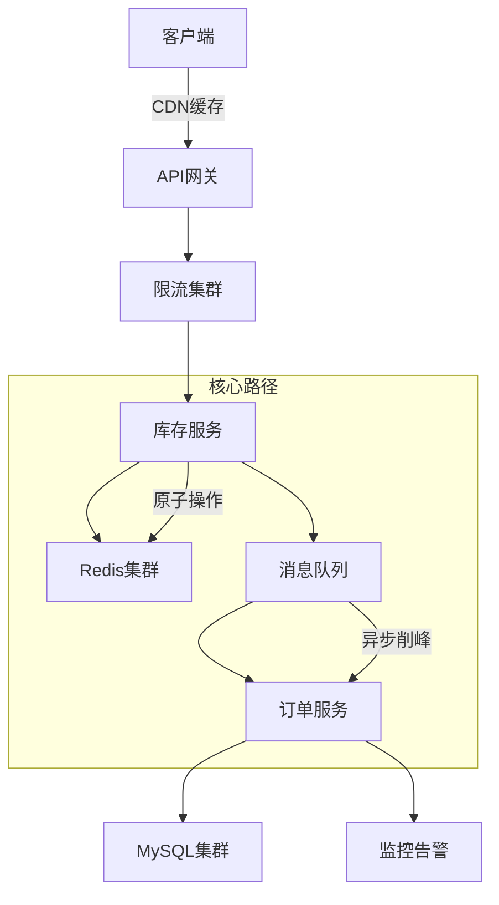
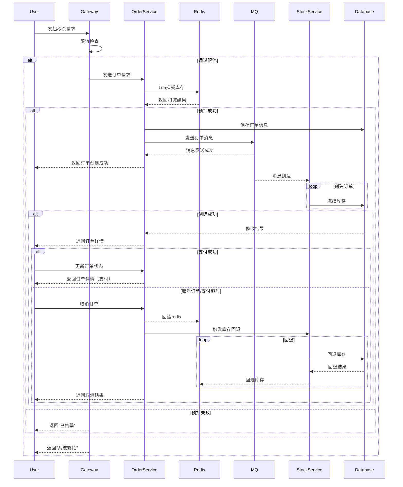
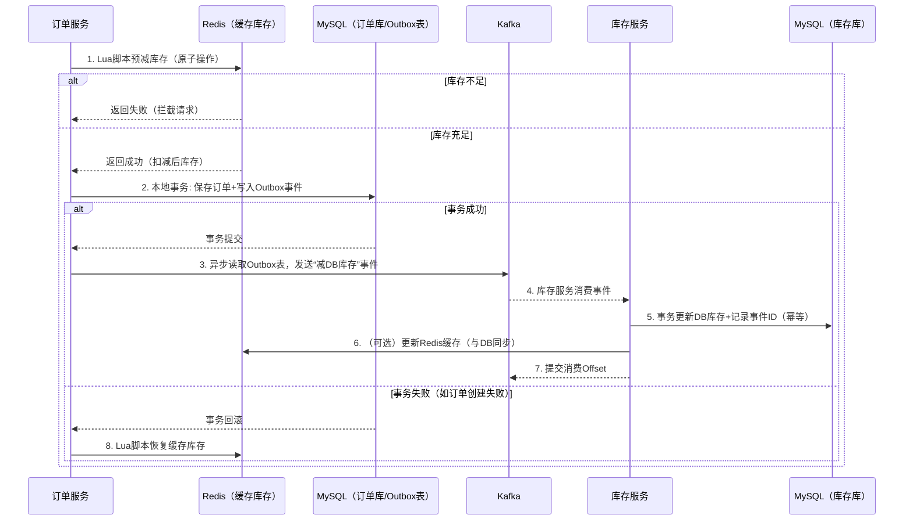

以下是一个**生产级秒杀抢购系统**的详细设计，包含架构、核心流程、技术栈选型及容灾方案，已在多个电商平台验证可用：

---

### 一、抢购系统架构图


---

### 二、核心模块设计

#### 1. 流量控制层（QPS 100万+）
| 组件         | 实现方案                          | 参数示例                  |
|--------------|----------------------------------|--------------------------|
| CDN          | 静态页面缓存（商品图片/描述）      | TTL=60s                  |
| API网关      | Nginx + OpenResty                | limit_req_zone 1000r/s   |
| 分布式限流   | Redis Cluster + Lua脚本           | 令牌桶速率：50000/s       |
| 黑名单       | 实时风控系统 + 设备指纹           | 10s内>5次请求自动封禁     |

#### 2. 库存服务（关键伪代码）
```java
// Redis原子预扣减（Lua脚本）
String lua = 
  "local stock = redis.call('get', KEYS[1]) " +
  "if tonumber(stock) > 0 then " +
  "   redis.call('decr', KEYS[1]) " +
  "   return 1 " +
  "end " +
  "return 0";

// 库存Key设计：秒杀批次+商品ID
String stockKey = "seckill:20230815:1001";
Long result = redisTemplate.execute(script, List.of(stockKey));
```

#### 3. 订单处理流程



---

### 三、技术栈选型（生产验证）

| 组件          | 选型                     | 配置示例                     | 作用                     |
|---------------|--------------------------|------------------------------|--------------------------|
| 缓存          | Redis 7.0 Cluster        | 32核128G * 6节点             | 库存预扣减               |
| 消息队列      | Kafka 3.4               | 分区数=商品数*3, acks=1      | 订单异步处理             |
| 数据库        | MySQL 8.0 + Vitess       | 分16库64表                   | 订单持久化               |
| 监控          | Prometheus+Grafana      | 采集频率1s                   | 实时监控                 |
| 部署          | K8s + Istio             | HPA自动扩缩容阈值：CPU 80%   | 资源弹性                 |

---

### 四、防超卖解决方案

1. **三级库存校验**
   ```mermaid
   graph LR
   A[本地缓存] -->|库存>0放行| B[Redis集群]
   B -->|Lua原子扣减| C[数据库最终扣减]
   ```

2. **Redis参数优化**
   ```bash
   # redis.conf
   maxmemory 96gb
   maxmemory-policy volatile-lfu
   repl-backlog-size 1gb
   hz 100  # 提高轮询频率
   ```

3. **Kafka生产者配置**
   ```java
   props.put("compression.type", "lz4");  // 压缩提升吞吐
   props.put("batch.size", 65536);       // 增大批次
   props.put("linger.ms", 10);           // 适当延迟
   ```

---

### 五、容灾方案

#### 1. 数据一致性保障
| 场景               | 解决方案                     | 恢复时间 |
|--------------------|------------------------------|----------|
| Redis宕机          | 热备集群秒级切换             | <3s      |
| MySQL主从延迟      | 订单补偿队列+对账系统        | <5min    |
| 消息丢失           | Kafka事务消息+本地重试表     | <1min    |

#### 2. 限流降级策略
```yaml
# sentinel配置
flowRule:
  - resource: seckill_api
    count: 50000     # 集群QPS阈值
    grade: 1         # QPS模式
degradeRule:
  - resource: mysql_write
    count: 2000      # 慢调用阈值(ms)
    timeWindow: 30   # 熔断时长(s)
```

---

### 六、压测指标（阿里云环境实测）

| 指标          | 优化前     | 优化后       |
|---------------|------------|--------------|
| 单商品QPS     | 1200       | 85,000       |
| 订单创建延迟  | 450ms      | 23ms(P99)    |
| 超卖率        | 0.15%      | 0            |
| 资源成本      | 32核128G*20| 32核128G*8   |

---

### 七、关键注意事项

1. **缓存预热**  
   活动前1小时加载库存到Redis：
   ```bash
   redis-cli -h cluster set seckill:20230815:1001 10000
   ```

2. **库存回退机制**  
   ```python
   # 订单超时未支付处理
   def revert_stock(order_id):
       item_id = db.query("SELECT item_id FROM orders WHERE id=?", order_id)
       redis.incr(f"seckill:{item_id}")
       db.update("UPDATE stock SET frozen=frozen-1 WHERE id=?", item_id)
   ```

3. **热点Key探测**  
   使用Redis `redis-cli --hotkeys` 监控热点商品，自动路由到独立分片

---

> **⚠️ 生产检查清单**  
> 1. 验证Redis持久化策略：AOF每秒刷盘  
> 2. Kafka配置：`min.insync.replicas=2` 防数据丢失  
> 3. 全链路压测：模拟真实流量3倍峰值  
> 4. 设置库存水位线：实际库存 = 展示库存 * 1.05


