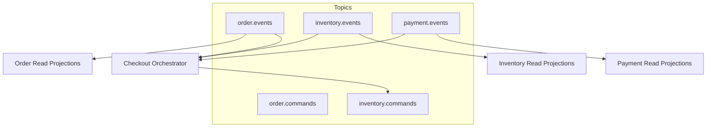
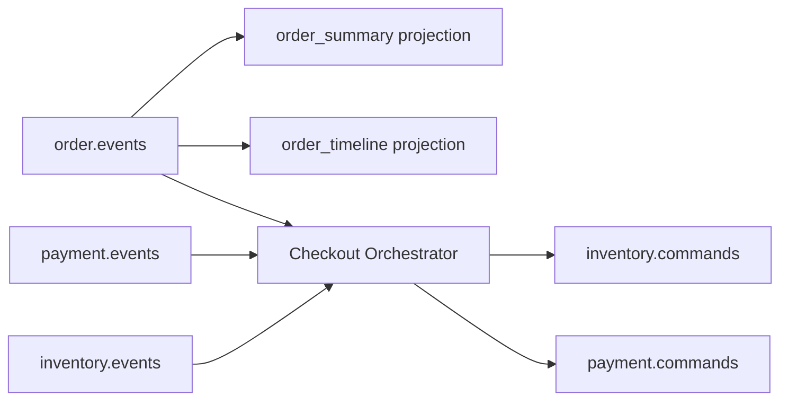

# 消费者拓扑（Consumer Topology）

## 全局拓扑

## 订单 ES 专题拓扑

## 分区与有序性保证

### 分区策略
- **聚合级有序**：同一 `aggregateId` 的事件在同一分区内保证有序
- **热点分桶**：高频聚合 ID 使用一致性哈希分桶避免单分区过载
- **跨聚合无序**：不保证跨聚合的全局顺序，需要业务层幂等处理

### 乱序与迟到事件处理
- **乱序容忍窗口**：5分钟内的事件可以乱序到达
- **迟到事件处理**：
  - 时间窗口内：正常处理并更新投影
  - 超出窗口：记录到专门的迟到事件表，人工处理
- **版本冲突**：基于事件版本号进行乐观并发控制

### 投影幂等与 Offset 管理
- **幂等机制**：使用 `projection_offset` 表记录每个投影的处理进度
- **Upsert 模式**：投影更新使用 upsert 语义，支持重复处理
- **故障恢复**：从最后成功的 offset 重新开始消费