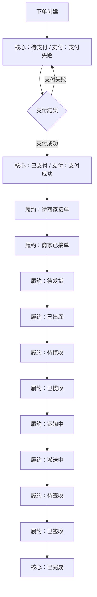
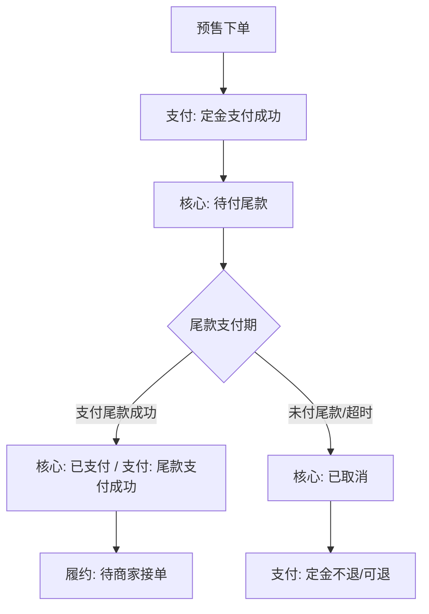
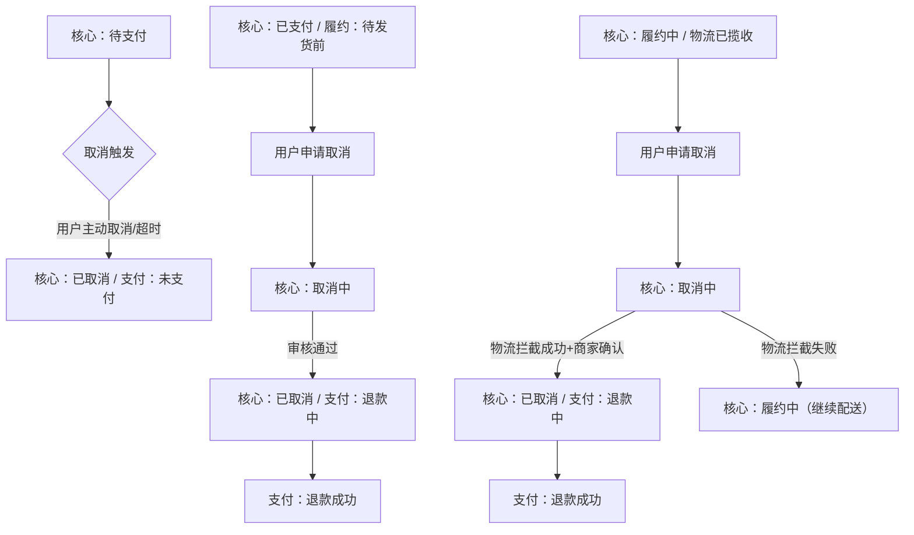
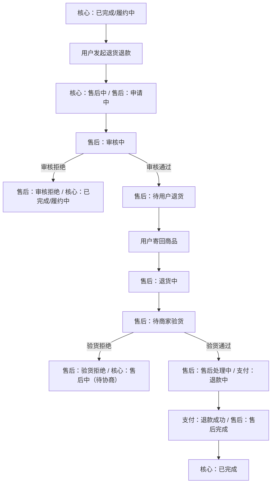

以「订单全生命周期」为轴，拆分出**核心订单状态**（全局状态）、**履约状态**（物流/执行子状态）、**关联状态**（支付/售后等联动状态）三类，且状态流转需满足“约束性”（如已签收订单无法直接回退到待发货）和“场景适配性”（如支持直播预售、短视频带货等字节特色场景）。

### 一、核心订单状态：订单全局生命周期的“总开关”
核心订单状态是订单从创建到终止的**顶层状态**，决定了订单的核心阶段，所有子状态（履约、支付、售后）均围绕其联动。字节商城的核心订单状态可分为10类，覆盖“创建-支付-履约-完成/终止”全链路：

| 核心订单状态       | 定义与触发场景                                                                 | 关联子状态（履约/支付/售后）                  |
|--------------------|------------------------------------------------------------------------------|---------------------------------------------|
| 1. 待支付          | 用户完成下单（选品、填地址）但未支付，或支付未成功（如扣款失败）。             | 支付状态：待支付/支付失败；无履约/售后状态   |
| 2. 待付尾款        | 预售场景专属：用户已支付定金，等待尾款支付期（如“双11预售”）。               | 支付状态：定金支付成功/尾款待支付           |
| 3. 已支付          | 用户完成全款支付（或预售尾款支付），资金已到账（字节支付/第三方支付确认）。     | 履约状态：待商家接单；支付状态：支付成功    |
| 4. 待履约          | 已支付后，商家未开始发货操作（如未接单、未出库），等待商家执行发货流程。       | 履约状态：待商家接单/商家已接单/待发货      |
| 5. 履约中          | 商家已完成发货操作，物流环节已启动（如物流揽收、运输、派送），未到签收环节。   | 履约状态：已出库/待揽收/已揽收/运输中/派送中 |
| 6. 已完成          | 订单正常结束：用户签收商品且无售后（或售后已完成），或系统自动确认完成（如7天无售后）。 | 履约状态：已签收；售后状态：无/已完成       |
| 7. 取消中          | 用户申请取消订单（如未发货时申请取消），等待商家/平台审核，未最终确认取消。    | 支付状态：待退款（若已支付）；无履约状态    |
| 8. 已取消          | 订单终止：可能是“待支付超时”“取消申请审核通过”“订单无效”（如违规订单）。       | 支付状态：未支付/退款成功；履约状态：无     |
| 9. 售后中          | 用户发起售后（退款、换货、维修），且售后流程未结束（如审核中、退货中）。       | 售后状态：申请中/审核中/退货中/验货中；履约状态：暂停 |
| 10. 已关闭         | 特殊场景订单终止：如订单信息无效（地址错误、商品下架）、系统判定违规（刷单），由平台强制关闭。 | 支付状态：未支付/退款成功；履约状态：无     |

### 二、履约状态：订单执行环节的“进度条”
履约状态是**核心订单状态的子状态**，仅在“待履约”“履约中”“售后换货”等阶段生效，聚焦“商家发货-物流运输-用户签收”的执行细节，是用户感知订单进度的核心依据（如抖音商城“我的订单”中显示的“运输中”“派送中”）。

字节商城的履约状态可细分为11类，覆盖“商家操作-物流操作-用户签收”全履约链路：

| 履约状态           | 定义与触发场景                                                                 | 所属核心订单状态       | 关键触发方       |
|--------------------|------------------------------------------------------------------------------|----------------------|------------------|
| 1. 待商家接单      | 用户已支付，订单已同步至商家后台，但商家未点击“确认接单”（如商家未查看、系统未自动接单）。 | 已支付/待履约        | 商家/系统        |
| 2. 商家已接单      | 商家确认接收订单（手动点击或系统自动接单，如“48小时自动接单”规则），准备备货。 | 待履约               | 商家/系统        |
| 3. 待发货          | 商家已接单，商品已在仓库备货，但未完成“出库”操作（未生成物流单号）。             | 待履约               | 商家             |
| 4. 已出库          | 商家完成仓库出库操作（商品从库存中调出，打包完成），已生成物流单号但未同步给物流。 | 待履约/履约中        | 商家             |
| 5. 待揽收          | 商家已同步物流单号至物流平台，等待物流公司上门取件（如顺丰、中通取件）。         | 履约中               | 物流方           |
| 6. 已揽收          | 物流公司上门取件完成，商品正式进入物流运输环节（物流系统更新“揽收成功”）。       | 履约中               | 物流方           |
| 7. 运输中          | 商品在物流中转环节（如从商家所在地仓库运往用户所在城市的中转仓），未到派送环节。 | 履约中               | 物流方           |
| 8. 派送中          | 商品已到达用户所在城市的派送点，物流员正在安排配送（如“今日18:00前送达”）。     | 履约中               | 物流方           |
| 9. 待签收          | 物流员已到达配送地址（如小区门口、快递柜），等待用户取件或确认签收。             | 履约中               | 用户/物流方      |
| 10. 已签收         | 用户确认收货（手动点击“确认签收”或物流系统自动确认，如快递柜取件后24小时）。     | 履约中→已完成        | 用户/物流方/系统 |
| 11. 履约异常       | 履约环节出现问题：如商家缺货无法发货、物流停滞（超48小时无更新）、地址错误无法配送。 | 待履约/履约中        | 商家/物流方/系统 |

### 三、关联状态：与核心订单状态联动的“辅助开关”
关联状态是支撑核心订单状态的“子模块”，主要包括**支付状态**（资金流）和**售后状态**（逆向流程），需与核心订单状态同步变更（如“已支付”必须对应“支付成功”，“售后中”必须对应“售后申请中/审核中”）。

#### 1. 支付状态：订单资金流的“晴雨表”
支付状态直接关联“待支付”“已支付”“已取消”等核心订单状态，覆盖“支付发起-扣款-退款”全资金链路：

| 支付状态           | 定义与触发场景                                                                 | 关联核心订单状态       |
|--------------------|------------------------------------------------------------------------------|----------------------|
| 1. 待支付          | 用户下单后未点击“支付”，或点击后未完成付款（如跳转支付宝后未输入密码）。         | 待支付               |
| 2. 支付中          | 用户已发起支付请求（如点击“微信支付”），但第三方支付平台未反馈扣款结果（如网络延迟）。 | 待支付               |
| 3. 支付成功        | 第三方支付平台（微信、支付宝、字节支付）确认扣款完成，资金已转入字节/商家账户。   | 待支付→已支付        |
| 4. 支付失败        | 扣款未成功（如余额不足、银行卡冻结、风控拦截），支付平台反馈“失败”。             | 待支付（可重新支付） |
| 5. 退款中          | 用户申请退款（如取消订单、售后退款），平台已受理但未完成资金退回（如审核中、银行处理中）。 | 取消中/售后中        |
| 6. 退款成功        | 退款资金已退回用户原支付账户（如微信零钱、银行卡），支付平台反馈“退款完成”。     | 已取消/售后中→已完成 |
| 7. 退款失败        | 退款流程异常（如用户银行卡已注销、银行系统故障），资金无法退回。                 | 取消中/售后中        |

#### 2. 售后状态：订单逆向流程的“追踪器”
售后状态仅在核心订单状态为“售后中”时生效，覆盖“售后申请-审核-退货-处理”全逆向链路（支持退款、换货、维修三类场景，字节商城以“退款/换货”为主）：

| 售后状态           | 定义与触发场景                                                                 | 关联核心订单状态       | 适用售后类型       |
|--------------------|------------------------------------------------------------------------------|----------------------|--------------------|
| 1. 售后申请中      | 用户提交售后申请（填写原因、上传凭证），但平台/商家未开始审核。                 | 已完成/履约中→售后中 | 退款/换货          |
| 2. 售后审核中      | 平台/商家已接收售后申请，正在核查订单信息、凭证（如“是否已签收”“商品是否影响二次销售”）。 | 售后中               | 退款/换货          |
| 3. 审核通过        | 平台/商家确认售后申请有效（如“7天无理由退货符合规则”），进入下一步处理。         | 售后中               | 退款/换货          |
| 4. 审核拒绝        | 售后申请不符合规则（如“超过7天无理由期限”“商品已使用且无质量问题”），售后终止。 | 售后中→已完成/履约中 | 退款/换货          |
| 5. 待用户退货      | 审核通过且需用户寄回商品（如“退货退款”“换货”），等待用户发出退货包裹。           | 售后中               | 退款/换货          |
| 6. 退货中          | 用户已寄出退货包裹，物流系统显示“已揽收”但未到达商家仓库。                       | 售后中               | 退款/换货          |
| 7. 待商家验货      | 退货包裹已到达商家仓库，商家未开箱核查商品（如“是否破损”“是否为原商品”）。       | 售后中               | 退款/换货          |
| 8. 验货通过        | 商家确认退货商品符合要求（无破损、不影响二次销售），准备处理退款/换货。           | 售后中               | 退款/换货          |
| 9. 验货拒绝        | 商家确认退货商品不符合要求（如“已破损”“非原订单商品”），拒绝继续售后。           | 售后中（待协商）     | 退款/换货          |
| 10. 售后处理中     | 验货通过后，正在执行售后动作：退款（平台打款）、换货（商家备新货）。             | 售后中               | 退款/换货          |
| 11. 售后完成       | 售后动作执行完毕：退款到账、换货商品已发货。                                     | 售后中→已完成/履约中 | 退款/换货          |
| 12. 售后关闭       | 售后流程终止（如用户主动取消申请、验货拒绝后协商失败）。                           | 售后中→已完成/履约中 | 退款/换货          |

### 四、状态流转规则：“不可逆+场景约束”的核心逻辑
字节商城的订单状态流转并非随意跳转，需遵循“**不可逆为主、场景化例外**”的原则，且每个流转节点需触发方（用户/商家/物流/系统）的操作或规则触发。以下分**正常流程**和**异常流程**拆解核心流转链路：

#### 1. 普通实物订单正常流转链路（核心订单状态+履约状态+支付状态）

#### 2. 预售订单特殊流转链路（多“付定金-付尾款”环节）

#### 3. 订单取消异常流转链路（不同阶段的取消逻辑）

#### 4. 售后异常流转链路（以“退货退款”为例）

### 五、商城的状态设计特色
1. **场景适配性**：针对直播/短视频带货的“即时性”，缩短“待支付”超时时间（如默认15分钟）；针对预售场景，单独设计“待付尾款”状态，同步定金/尾款支付进度。
2. **用户感知性**：履约状态与物流系统实时联动（如“运输中”显示具体中转节点：“北京中转仓→上海中转仓”），在抖音APP内通过“物流地图”可视化展示，提升用户体验。
3. **系统自动化**：多数状态流转由系统自动触发（如“已签收”后7天无售后自动变为“已完成”、“待支付”超时自动变为“已取消”），减少人工干预，提升效率。
4. **风险管控**：异常状态（如“履约异常”“退款失败”）会触发系统预警，同步给商家/客服（如“物流停滞超48小时”自动推送提醒给商家，要求跟进），降低用户投诉率。

通过以上状态体系，字节商城实现了对订单“正向履约”和“逆向售后”的全链路管控，既满足用户对订单进度的清晰感知，也支撑商家/平台对订单流程的高效运营。