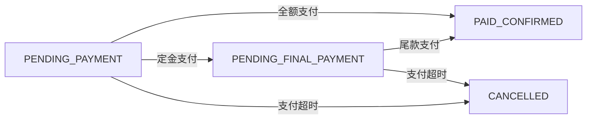
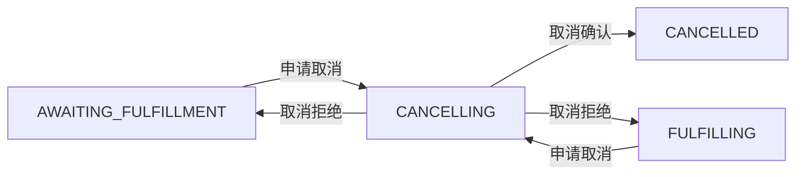
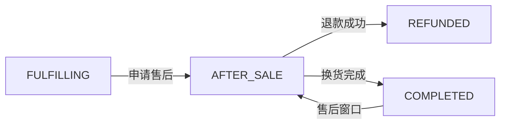

# 订单状态机设计文档

## 设计概述

订单状态机采用有限状态机 (FSM) 模式，确保订单状态转换的一致性和可靠性。基于 `CoreFlowStatus` 枚举实现，支持严格的状态转换约束和幂等性处理。

## 状态定义

### 活跃状态 (非终态)
| 状态 | 英文名称 | 描述 | 可转换到 |
|------|----------|------|----------|
| 待支付 | PENDING_PAYMENT | 订单已创建，等待用户支付 | PAID_CONFIRMED, PENDING_FINAL_PAYMENT, CANCELLED, CLOSED |
| 待付尾款 | PENDING_FINAL_PAYMENT | 预售场景，定金已付，等待尾款 | PAID_CONFIRMED, CANCELLED, CLOSED |
| 支付确认 | PAID_CONFIRMED | 支付成功，等待系统确认 | AWAITING_FULFILLMENT, CLOSED |
| 待履约 | AWAITING_FULFILLMENT | 等待商家处理订单 | FULFILLING, CANCELLING, CLOSED |
| 履约中 | FULFILLING | 商家已发货，物流进行中 | COMPLETED, AFTER_SALE, CANCELLING, CLOSED |
| 售后中 | AFTER_SALE | 用户申请售后，正在处理 | REFUNDED, COMPLETED, CLOSED |
| 取消中 | CANCELLING | 申请取消，等待确认 | CANCELLED, AWAITING_FULFILLMENT, FULFILLING, CLOSED |

### 终态状态
| 状态 | 英文名称 | 描述 | 特点 |
|------|----------|------|------|
| 已完成 | COMPLETED | 订单正常完成 | 终态，不可转换 |
| 已取消 | CANCELLED | 订单已取消 | 终态，不可转换 |
| 已关闭 | CLOSED | 风控或系统关闭 | 终态，不可转换 |
| 已退款 | REFUNDED | 售后退款完成 | 终态，不可转换 |

## 状态转换规则

### 支付流程


### 履约流程


### 取消流程


### 售后流程


## 转换约束

### 1. 严格的前置状态检查
每个状态转换都有明确的前置状态要求：

```java
// 示例：支付成功只能从待支付状态转换
public void handlePaymentSuccess(String orderId) {
    Order order = loadOrder(orderId);
    if (order.getStatus() != PENDING_PAYMENT && 
        order.getStatus() != PENDING_FINAL_PAYMENT) {
        throw new IllegalStateTransitionException(
            "支付成功回调要求订单状态为待支付或待付尾款");
    }
    transitionTo(order, PAID_CONFIRMED);
}
```

### 2. 终态保护
终态状态不允许任何转换（除风控关闭外）：

```java
private void validateNotTerminal(CoreFlowStatus currentStatus) {
    if (currentStatus.isTerminal()) {
        throw new IllegalStateTransitionException(
            "终态订单不允许状态转换: " + currentStatus);
    }
}
```

### 3. 业务规则验证
转换前进行业务规则检查：

```java
// 示例：发货前检查是否已接单
private void validateShipmentPreconditions(Order order) {
    if (!order.isMerchantAccepted()) {
        throw new BusinessRuleViolationException("商家未接单，无法发货");
    }
}
```

## 幂等性机制

### 1. 请求级幂等性
每个状态转换操作支持幂等性键：

```java
@IdempotentOperation
public StateTransitionResult processPaymentSuccess(
        String orderId, 
        PaymentSuccessEvent event,
        @IdempotencyKey String idempotencyKey) {
    
    // 检查幂等性缓存
    if (idempotencyCache.exists(idempotencyKey)) {
        return idempotencyCache.get(idempotencyKey);
    }
    
    // 执行状态转换
    StateTransitionResult result = doProcessPaymentSuccess(orderId, event);
    
    // 缓存结果
    idempotencyCache.put(idempotencyKey, result, Duration.ofHours(24));
    
    return result;
}
```

### 2. 状态转换幂等性
相同状态转换的重复执行是安全的：

```java
public void transitionTo(Order order, CoreFlowStatus targetStatus) {
    CoreFlowStatus currentStatus = order.getStatus();
    
    // 如果已经是目标状态，直接返回（幂等）
    if (currentStatus == targetStatus) {
        log.info("订单 {} 已经是目标状态 {}", order.getId(), targetStatus);
        return;
    }
    
    validateTransition(currentStatus, targetStatus);
    executeTransition(order, targetStatus);
}
```

### 3. 事件幂等性
基于事件ID确保事件处理的幂等性：

```java
@EventHandler
public void handlePaymentSuccessEvent(PaymentSuccessEvent event) {
    String eventId = event.getEventId();
    
    if (processedEvents.contains(eventId)) {
        log.info("事件 {} 已处理，跳过", eventId);
        return;
    }
    
    try {
        processPaymentSuccess(event);
        processedEvents.add(eventId);
    } catch (Exception e) {
        log.error("处理支付成功事件失败", e);
        throw e;
    }
}
```

## 错误处理策略

### 1. 状态转换异常
```java
public class IllegalStateTransitionException extends BusinessException {
    private final CoreFlowStatus currentStatus;
    private final CoreFlowStatus targetStatus;
    
    public IllegalStateTransitionException(
            CoreFlowStatus current, 
            CoreFlowStatus target) {
        super(String.format("无法从状态 %s 转换到 %s", current, target));
        this.currentStatus = current;
        this.targetStatus = target;
    }
}
```

### 2. 并发冲突处理
使用乐观锁处理并发状态更新：

```java
@Retryable(value = OptimisticLockException.class, maxAttempts = 3)
public void updateOrderStatus(String orderId, CoreFlowStatus newStatus) {
    Order order = orderRepository.findByIdWithLock(orderId);
    order.setStatus(newStatus);
    order.incrementVersion();
    
    try {
        orderRepository.save(order);
    } catch (OptimisticLockException e) {
        log.warn("订单 {} 状态更新冲突，重试", orderId);
        throw e;
    }
}
```

### 3. 事务失败回滚
状态转换失败时的回滚策略：

```java
@Transactional
public void processOrderTransition(String orderId, TransitionEvent event) {
    try {
        // 1. 更新订单状态
        updateOrderStatus(orderId, event.getTargetStatus());
        
        // 2. 发布事件
        eventPublisher.publish(createTransitionEvent(orderId, event));
        
        // 3. 更新相关资源
        updateRelatedResources(orderId, event);
        
    } catch (Exception e) {
        log.error("订单状态转换失败，回滚: {}", orderId, e);
        // 事务自动回滚
        throw new StateTransitionException("状态转换失败", e);
    }
}
```

## 监控和度量

### 1. 状态转换指标
```java
// 转换成功率
Counter.builder("order.state.transition.success")
    .tag("from", fromStatus.name())
    .tag("to", toStatus.name())
    .register(meterRegistry)
    .increment();

// 转换延迟
Timer.Sample sample = Timer.start(meterRegistry);
// ... 执行转换
sample.stop(Timer.builder("order.state.transition.duration")
    .tag("transition", fromStatus + "_to_" + toStatus)
    .register(meterRegistry));
```

### 2. 状态分布监控
```java
// 各状态的订单数量
@Scheduled(fixedRate = 60000) // 每分钟更新
public void updateOrderStatusMetrics() {
    for (CoreFlowStatus status : CoreFlowStatus.values()) {
        long count = orderRepository.countByStatus(status);
        Gauge.builder("order.status.count")
            .tag("status", status.name())
            .register(meterRegistry, () -> count);
    }
}
```

### 3. 异常监控
```java
// 非法状态转换告警
@EventListener
public void handleIllegalTransition(IllegalStateTransitionException e) {
    alertService.sendAlert(
        "非法订单状态转换",
        String.format("订单: %s, 从 %s 到 %s", 
            e.getOrderId(), e.getCurrentStatus(), e.getTargetStatus())
    );
}
```

## 扩展性设计

### 1. 状态转换钩子
支持在状态转换前后添加自定义逻辑：

```java
public interface StateTransitionHook {
    void beforeTransition(Order order, CoreFlowStatus fromStatus, CoreFlowStatus toStatus);
    void afterTransition(Order order, CoreFlowStatus fromStatus, CoreFlowStatus toStatus);
}

@Component
public class InventoryReleaseHook implements StateTransitionHook {
    @Override
    public void afterTransition(Order order, CoreFlowStatus from, CoreFlowStatus to) {
        if (to == CANCELLED) {
            inventoryService.releaseReservation(order.getId());
        }
    }
}
```

### 2. 条件转换
支持基于条件的状态转换：

```java
public interface TransitionCondition {
    boolean canTransition(Order order, CoreFlowStatus targetStatus);
}

public class PaymentCondition implements TransitionCondition {
    @Override
    public boolean canTransition(Order order, CoreFlowStatus targetStatus) {
        if (targetStatus == AWAITING_FULFILLMENT) {
            return paymentService.isPaymentCompleted(order.getPaymentId());
        }
        return true;
    }
}
```

## 测试策略

### 1. 状态转换测试
```java
@Test
public void shouldTransitionFromPendingPaymentToConfirmed() {
    // Given
    Order order = createOrderInStatus(PENDING_PAYMENT);
    PaymentSuccessEvent event = new PaymentSuccessEvent(order.getId());
    
    // When
    stateTransitionService.handlePaymentSuccess(order.getId(), event);
    
    // Then
    Order updatedOrder = orderRepository.findById(order.getId());
    assertThat(updatedOrder.getStatus()).isEqualTo(PAID_CONFIRMED);
}
```

### 2. 幂等性测试
```java
@Test
public void shouldBeIdempotentForSameTransition() {
    // Given
    Order order = createOrderInStatus(PENDING_PAYMENT);
    String idempotencyKey = "test-key-12345";
    
    // When - 执行两次相同操作
    StateTransitionResult result1 = processPaymentSuccess(order.getId(), idempotencyKey);
    StateTransitionResult result2 = processPaymentSuccess(order.getId(), idempotencyKey);
    
    // Then - 结果应该相同
    assertThat(result1).isEqualTo(result2);
    assertThat(orderRepository.findById(order.getId()).getStatus())
        .isEqualTo(PAID_CONFIRMED);
}
```

### 3. 异常场景测试
```java
@Test
public void shouldThrowExceptionForIllegalTransition() {
    // Given
    Order order = createOrderInStatus(COMPLETED);
    
    // When & Then
    assertThatThrownBy(() -> {
        stateTransitionService.transitionTo(order, CANCELLED);
    }).isInstanceOf(IllegalStateTransitionException.class)
      .hasMessageContaining("终态订单不允许状态转换");
}
```

这个状态机设计确保了订单状态转换的可靠性、一致性和可维护性，同时提供了良好的扩展性和监控能力。