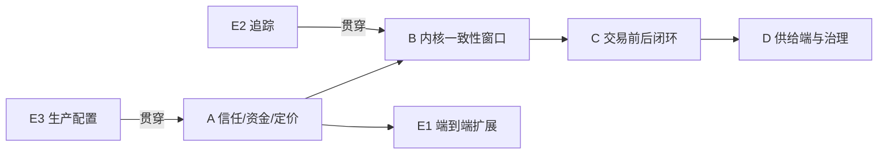

# Tiny Store：从 Demo 迈向可上线的落地路线

> 依据：[demo-vs-production-gap-analysis.md](demo-vs-production-gap-analysis.md)。
> 目标：把“决定它还是 Demo 的核心差异”逐项转成可执行、可验收、按依赖排序的建设清单。
> 排序原则：**先让交易路径可信、资金为真 → 再补交易前后的数据闭环与供给端 → 最后才谈规模**。每项给出量化验收标准，避免“做了但没达标”。

---

## A. 必须先做：让交易路径“可信”（不修则永远是 Demo）

目标是让“下单 → 支付 → 履约”这一条最核心路径，在无鉴权、伪造身份、伪造价格、伪造支付的情况下都不成立。

| # | 事项 | 现状 | 为何关键 | 验收标准 |
|---|---|---|---|---|
| A1 | 网关强制鉴权 | `SecurityConfig:14` 默认关 | 信任边界的地基 | 默认配置下所有业务接口无 token 一律 401；健康检查/Prometheus 除外；新增一条“未带 token 访问 `/api/order` 被拒”的 IT |
| A2 | 订单接口绑定认证主体 | `TradeController:53` 用 body 的 buyerId | 防止跨用户操作 | 取消/确认收货/售后必须从认证主体取 buyerId；用他人 token 操作他人订单返回 403（带所有权校验 IT） |
| A3 | 服务端权威定价 | `TradeApplicationService:1124` 用客户端价 | 防止 1 分钱下单 | createTrade 调 `ProductClient` 取目录价/最新报价，与客户端价不一致即拒绝（正/负向单元测试） |
| A4 | 支付回调验签+真实渠道 | `PaymentApplicationService:319/130` 全模拟 | 资金为真 | `pay/callback` 增加渠道签名（HMAC/RSA）校验；无有效签名不推进；支付单、退款记录走真实渠道回调流程 |

> **判定**：A1–A4 全部落地后，核心交易路径才第一次“可信”。这是摘掉 Demo 帽子的门槛，优先级最高。

---

## B. 紧接着修：交易内核的一致性窗口

| # | 事项 | 现状 | 验收标准 |
|---|---|---|---|
| B1 | 支付后库存确认加再驱动 | `onPaymentSucceeded` 异步 confirm 无重试 | 新增调度/补偿：扫描“交易已 PAID 但库存预约仍 PRE_DEDUCTED 且未过期”的记录并重放 `INVENTORY_CONFIRM`；集成测试覆盖“confirm 事件丢失后能自愈” |
| B2 | 预约过期与支付状态绑定 | `ReservationExpiryTask` 只按 `expire_at` | 过期任务跳过“已关联 PAID 交易”的预约；已付订单的预约不被过期释放；测试覆盖“已付但 confirm 迟到”不释放 |
| B3 | 订单投影与库存源一致 | 订单域乐观置 `CONFIRMED` | 订单 `inventoryStatus` 不再先于库存源确认写 `CONFIRMED`；以库存域回执为准；一致性测试断言订单/库存最终一致 |

> 说明：A 层解决“墙是开的”，B 层解决“墙内也有缝”。B1 与 A4 强相关——真实渠道回调解锁后要能稳定驱动库存确认。

---

## C. 补齐“交易前后”的数据闭环（让系统像个商城，而不只是下单 API）

| # | 事项 | 投入 | 说明 / 验收 |
|---|---|---|---|
| C1 | 收货地址 CRUD | S | `ConsumerAddress` 已有实体，补接口；下单校验 addressId 存在且属于当前用户 |
| C2 | 买家“我的订单”列表 | S | 列表 + 分页 + 状态筛选；按认证主体隔离数据 |
| C3 | 商家订单列表/筛选/批量发货 | M | 商家订单工作台；支持按状态/时间筛选、批量发货 |
| C4 | 商品搜索 | M | 先用 PostgreSQL 全文检索/`pg_trgm`，验收购物车/详情跳转；后续再迁 OpenSearch |
| C5 | SPU 详情聚合 | M | 引入 `spu -> sku` 两层模型；详情页返回同款多规格聚合 |
| C6 | 评价/评分 | M | 评价表 + 评分聚合；商品详情展示评分；商家 DSR 先行 |
| C7 | 购物车 | M | 加购、合并、结算跳转；与 C1/C2 打通 |

---

## D. 供给端与平台治理（B 端能活、平台有商业模式）

| # | 事项 | 投入 | 说明 |
|---|---|---|---|
| D1 | 商家入驻/店铺管理 | M | `MerchantAccountApplicationService` 目前空壳；补齐入驻、店铺、上架全流程 |
| D2 | 商家售后工作台 | M | 售后列表、审核、退货验收（寄回→验收→退款两段式） |
| D3 | 平台-商家结算清分 | L | settlement 表 + 清分规则 + T+N 打款；平台商业模式的根基 |
| D4 | 发票 | S | 开票请求、抬头、开具状态 |
| D5 | 风控/反刷 | L | 设备指纹、黑白名单、频控、交易风控；与 A1 的限流衔接 |
| D6 | 内容/会员/积分 | L | 会员等级、积分、内容营销；复购飞轮 |

---

## E. 端到端验证与可观测（证明“不是 Demo”）

| # | 事项 | 说明 |
|---|---|---|
| E1 | 端到端覆盖扩展 | 现 E2E 仅 1 条 happy path；新增“搜索→加购→结算→支付→物流→收货→评价→退款”全链路 + 多商品、多店铺、售后多态 |
| E2 | 分布式链路追踪 | 引入 `micrometer-tracing` + 采样导出；8 服务跨域失败可定位 |
| E3 | 生产配置与密钥管理 | 新增 prod profile；密码走环境变量/密钥管理；移除 `.dev.tinystore.com` 默认 |
| E4 | 种子数据外置 | 把 Flyway 里的 `V5/V7 e2e_seed` 移出核心迁移链，改独立的 seed 脚本/环境夹具 |

---

## 依赖与节奏建议

- **里程碑1 = A + E3**：让核心交易路径可信、可生产部署。这是“摘帽”标志。
- **里程碑2 = B + E1**：让一致性在异常/高峰下也成立，并用更广的 E2E 证明。
- **里程碑3 = C**：从“下单 API”变成“商城”。
- **里程碑4 = D**：B 端与平台治理。

---

## 判断“不是 Demo”的最终清单（复核 ABC）

以下全真，才可声称“不再是 Demo”：

1. 无 token 无法下单/支付/取消；跨用户操作被拒绝。
2. 下单价格来自服务端目录价，客户端无法改价。
3. 支付/退款经真实渠道回调且验签，未支付无法标记已付。
4. 已付订单的库存预约不会被过期释放；订单/库存最终一致。
5. 有搜索、购物车、地址、订单列表、评价；商家有入驻与工作台。
6. 有生产配置、分布式追踪、外置测试种子；无 mock 支付/退款。

