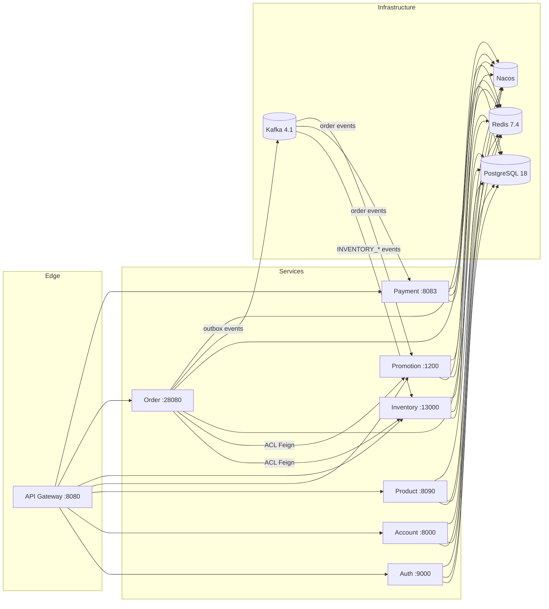

# Tiny Store GitHub README Implementation Plan

> **For agentic workers:** REQUIRED SUB-SKILL: Use superpowers:subagent-driven-development (recommended) or superpowers:executing-plans to implement this plan task-by-task. Steps use checkbox (`- [ ]`) syntax for tracking.

**Goal:** 为 GitHub 仓库 `jamespud/tiny-store` 生成 `README.md`（英文完整版）与 `README.zh-CN.md`（中文完整版），架构展示为主、双文件互链、含 Mermaid 架构图。

**Architecture:** 纯文档任务，无代码。`README.MD`（空文件，已被 git 跟踪）经 `git mv` 改名为 `README.md`；两个 README 文件互为镜像结构，顶部互放语言切换链接。所有事实已从 pom.xml、Makefile、docker-compose、init-db.sh 核实（根 CLAUDE.md 含未解决冲突标记，不作为事实来源）。

**Tech Stack:** Markdown（GitHub 风格）、Mermaid（flowchart LR，GitHub 原生渲染）、Make/Maven 命令引用。

## Global Constraints

- 不创建/修改任何 Java 代码；只动根目录两个 README 文件与 git 改名
- 仓库根 `CLAUDE.md` 有合并冲突标记（Updated upstream / Stashed changes），**禁止**引用其内容；事实以本计划内嵌文本为准
- 端口/schema/版本必须与下表一致（已核实）：Gateway 8080、Auth 9000、Account 8000、Product 8090、Promotion 1200、Inventory 13000、Order 28080、Payment 8083；schema 为 `tinystore_auth/account/product/promotion/inventory/order/payment`（gateway 无 schema）；基础设施版本 PostgreSQL 18.1、Redis 7.4.0、Kafka 4.1.1（apache/kafka）、Nacos v3.1.1
- 技术栈版本：Java 17、Spring Boot 3.5.0、Spring Cloud 2025.0.0、Spring Statemachine 4.0.1、Testcontainers
- 文档链接必须指向实际存在的文件：`docs/rfcs/RFC-001-canonical-inventory-reservation.md`、`docs/architecture/` 下 5 个 md、`docs/performance/` 下 2 个 md
- commit message 不带 Co-Authored-By 尾注
- 范围外：根目录 `BOOT-INF/`、`perf/` 等构建残留不动

---

### Task 1: 将空文件 README.MD 改名为 README.md

**Files:**
- Rename: `README.MD` → `README.md`（git mv，保留历史）

**Interfaces:**
- Consumes: 无
- Produces: 根目录存在 `README.md`（空），`README.MD` 从跟踪列表消失

- [ ] **Step 1: 执行改名**

```bash
git mv README.MD README.md
```

- [ ] **Step 2: 验证**

```bash
git ls-files | grep -i readme | head -3
```

Expected: 输出包含 `README.md`（不再有 `README.MD`）

- [ ] **Step 3: 提交**

```bash
git add README.md
git commit -m "chore: rename README.MD to README.md (canonical lowercase for GitHub)"
```

---

### Task 2: 写入 README.md（英文完整版）

**Files:**
- Modify: `README.md`（当前为空，全文写入）

**Interfaces:**
- Consumes: Task 1 的 `README.md`
- Produces: 英文完整版 README；Task 3 的中文版与之镜像对应（节标题一一对应，除语言切换块）

- [ ] **Step 1: 全文写入 README.md**

将以下内容完整写入 `README.md`：

```markdown
# Tiny Store

[English](README.md) | [简体中文](README.zh-CN.md)

A DDD-style microservices e-commerce platform. Eight deployable services behind an API gateway demonstrate production-grade distributed-system patterns: hexagonal architecture, transactional outbox, payment saga, distributed idempotency, anti-corruption layers, and a canonical inventory reservation state machine.


## Highlights

- 8 deployable microservices + 1 shared infrastructure library, single PostgreSQL database with per-domain schemas
- Hexagonal (ports & adapters) layering in every domain module: `domain / application / infrastructure / interfaces`
- Transactional outbox pattern (order domain → Kafka) with DLT support for reliable event delivery
- Payment saga orchestrated with Spring State Machine
- Redis-based request idempotency at gateway and order layers
- Canonical inventory reservation lifecycle (RFC-001): `PRE_DEDUCTED → CONFIRMED / RELEASED / EXPIRED`
- Feature flags for gradual rollout and dual-write compatibility during migration
- Four-tier testing strategy: unit → Testcontainers IT → black-box E2E → concurrency & load

## Architecture



The gateway routes and authenticates all external traffic. Services talk to each other only through ACL Feign clients (order → inventory, order → promotion); cross-domain state changes flow through Kafka as outbox-published domain events. PostgreSQL is the system of record (one schema per domain), Redis handles idempotency and the high-concurrency inventory pre-deduct gate, and Nacos provides service discovery.

## Services

| Module | Port | Schema | Purpose |
|--------|------|--------|---------|
| `tinystore-domain-gateway` | 8080 | — | Spring Cloud Gateway: routing, JWT auth, IP rate limiting, request idempotency |
| `tinystore-domain-auth` | 9000 | `tinystore_auth` | OTP/password auth, token revocation, consent, client registration |
| `tinystore-domain-account` | 8000 | `tinystore_account` | User accounts, addresses, merchant shops |
| `tinystore-domain-product` | 8090 | `tinystore_product` | Product/SKU catalog, specifications, attributes |
| `tinystore-domain-promotion` | 1200 | `tinystore_promotion` | Coupons, checkout quotes (quote/commit/release), budget monitoring |
| `tinystore-domain-inventory` | 13000 | `tinystore_inventory` | Reservation lifecycle, stock management, Redis pre-deduct gateway |
| `tinystore-domain-order` | 28080 | `tinystore_order` | Trade/order creation, payment saga, fulfillment, outbox events |
| `tinystore-domain-payment` | 8083 | `tinystore_payment` | Payment orders, refunds, notification retry |
| `tinystore-library-infrastructure` | — | — | Shared: Redis/Redisson, Kafka constants, Feign clients, JSON utils, security auto-config |

## Key Patterns

**Hexagonal architecture** — every domain module follows the same internal layering: `domain` (aggregates, domain services, repository ports), `application` (use-case orchestration), `infrastructure` (JPA persistence, ACL Feign clients, outbox/Kafka, schedulers), `interfaces` (REST controllers). Domain logic never depends on frameworks or other services.

**Transactional outbox** — order-domain writes are committed to the `outbox_event` table in the same transaction as the business write. `OutboxEventPublisherScheduler` polls and publishes to Kafka; failed deliveries land on a DLT. This guarantees at-least-once delivery without distributed transactions.

**Payment saga** — the order lifecycle (create → pay → confirm → fulfill → receipt) is orchestrated by a Spring State Machine; payment confirm/cancel drives inventory confirm/release through the event chain.

**Idempotency** — all critical mutating endpoints require an `Idempotency-Key` header. The order domain backs it with Redis (`IdempotencyService`); the gateway has a separate service with a local Caffeine fallback.

**Anti-corruption layer (ACL)** — inter-service calls use Feign clients under `infrastructure/acl/` (`InventoryClient`, `PromotionClient`) with per-domain DTO duplication, isolating each service from its neighbors' models.

**Feature flags** — gradual rollout via `@Value` / `@ConditionalOnProperty` (e.g. `order.inventory.use-canonical-reservation-api`, `inventory.reservation.canonical-enabled`), enabling dual-write compatibility and zero-downtime migration.

**Inventory reservation state machine (RFC-001)** — `inventory_reservation` is the single authority for the inventory lifecycle; Redis is a non-authoritative concurrency gate only. Lifecycle: `PRE_DEDUCTED → CONFIRMED` (payment success, terminal), `PRE_DEDUCTED → RELEASED` (cancel, terminal), `PRE_DEDUCTED → EXPIRED` (scheduler, terminal). `CONFIRMED → RELEASED` is forbidden — returns must go through after-sale/refund. See [RFC-001](docs/rfcs/RFC-001-canonical-inventory-reservation.md).

## Getting Started

Prerequisites: Docker, JDK 17 (Maven wrapper is included).

```bash
make debug    # build + start all 8 services and PostgreSQL/Redis/Kafka/Nacos
```

Wait for the gateway health check, then use the API via `http://localhost:8080`:

```bash
curl http://localhost:8080/actuator/health
```

| Service / Infra | Address |
|-----------------|---------|
| Gateway | http://localhost:8080 |
| Auth | http://localhost:9000 |
| Account | http://localhost:8000 |
| Product | http://localhost:8090 |
| Promotion | http://localhost:1200 |
| Inventory | http://localhost:13000 |
| Order | http://localhost:28080 |
| Payment | http://localhost:8083 |
| Nacos console | http://localhost:8848/nacos (nacos/nacos) |
| PostgreSQL | localhost:5432 |
| Redis | localhost:6379 |
| Kafka | localhost:9092 |

Stop the environment with `make down` (use `MODE=test make down` for the test environment).

## Testing

| Command | What it runs |
|---------|--------------|
| `make build` | Clean Maven build, tests skipped |
| `make unit` | Unit tests only (mocked deps, no Docker) |
| `make it` | Integration tests with Testcontainers (PostgreSQL, Kafka) |
| `make e2e` | Black-box API tests against the compose stack through the gateway |
| `make e2e-smoke` | Health-check-only E2E (gateway + all service routes) |
| `make test` | Full suite sequentially: unit → IT → E2E |
| `make consistency` | 200-concurrent-request consistency tests with DB assertions |
| `make load` | k6 load tests (p95/p99 latency metrics) |

Load-test results and methodology live under [`docs/performance/`](docs/performance/), architecture notes under [`docs/architecture/`](docs/architecture/).

## License

MIT — see [LICENSE](LICENSE).
```

- [ ] **Step 2: 验证文档链接与实际文件存在**

```bash
cd /home/spud/proj/tiny-store
for f in docs/rfcs/RFC-001-canonical-inventory-reservation.md docs/architecture docs/performance LICENSE; do test -e "$f" && echo "OK  $f" || echo "MISSING  $f"; done
```

Expected: 每行以 `OK` 开头，无 `MISSING`

- [ ] **Step 3: 验证 Mermaid 代码块配对**

```bash
grep -c '```mermaid' README.md && grep -c '^```$' README.md
```

Expected: 第一行输出 `1`（一个 mermaid 块），第二行输出 `3`（mermaid 块 1 个闭合围栏 + 2 个 bash 块闭合围栏，全文档代码围栏闭合配对）

- [ ] **Step 4: 验证结构与事实**

```bash
grep -E '8080|13000|28080|8083|8090|1200|8000|9000' README.md | head -12
```

Expected: 8 个服务端口全部出现在端口表（Gateway 8080 / Auth 9000 / Account 8000 / Product 8090 / Promotion 1200 / Inventory 13000 / Order 28080 / Payment 8083）

- [ ] **Step 5: 提交**

```bash
git add README.md
git commit -m "docs: add English README (architecture-focused, mermaid diagram, module table)"
```

---

### Task 3: 写入 README.zh-CN.md（中文完整版）

**Files:**
- Create: `README.zh-CN.md`

**Interfaces:**
- Consumes: Task 2 的 README.md（本文件与其节标题一一对应）
- Produces: 中文镜像 README；顶部语言切换链接指向 README.md

- [ ] **Step 1: 全文写入 README.zh-CN.md**

将以下内容完整写入 `README.zh-CN.md`：

```markdown
# Tiny Store

[English](README.md) | [简体中文](README.zh-CN.md)

一个 DDD 风格的微服务电商平台。API 网关之后是 8 个可部署服务，展示了生产级分布式系统模式：六边形架构、事务性 Outbox、支付 Saga、分布式幂等、防腐层（ACL）以及规范化的库存预扣状态机。


## 核心亮点

- 8 个可部署微服务 + 1 个共享基础设施库，单一 PostgreSQL 数据库、按领域分 schema
- 每个领域模块采用六边形（端口与适配器）分层：`domain / application / infrastructure / interfaces`
- 事务性 Outbox 模式（订单域 → Kafka），带 DLT，保证事件可靠投递
- 基于 Spring State Machine 编排的支付 Saga
- 网关与订单层基于 Redis 的请求幂等
- 规范化库存预扣生命周期（RFC-001）：`PRE_DEDUCTED → CONFIRMED / RELEASED / EXPIRED`
- 特性开关支持渐进式灰度与迁移期双写兼容
- 四层测试策略：单元 → Testcontainers 集成 → 黑盒 E2E → 并发与压测

## 架构总览


网关负责所有外部流量的路由与认证。服务之间只通过 ACL Feign 客户端通信（订单 → 库存、订单 → 促销）；跨领域的状态变更通过 Outbox 发布到 Kafka 的领域事件流动。PostgreSQL 是系统记录源（每个领域一个 schema），Redis 承担幂等与高并发库存预扣网关，Nacos 提供服务发现。

## 服务模块

| 模块 | 端口 | Schema | 职责 |
|--------|------|--------|---------|
| `tinystore-domain-gateway` | 8080 | — | Spring Cloud Gateway：路由、JWT 认证、IP 限流、请求幂等 |
| `tinystore-domain-auth` | 9000 | `tinystore_auth` | OTP/密码认证、令牌吊销、授权同意、客户端注册 |
| `tinystore-domain-account` | 8000 | `tinystore_account` | 用户账号、地址、商家店铺 |
| `tinystore-domain-product` | 8090 | `tinystore_product` | 商品/SKU 目录、规格、属性 |
| `tinystore-domain-promotion` | 1200 | `tinystore_promotion` | 优惠券、结算报价（quote/commit/release）、预算监控 |
| `tinystore-domain-inventory` | 13000 | `tinystore_inventory` | 预扣生命周期、库存管理、Redis 预扣网关 |
| `tinystore-domain-order` | 28080 | `tinystore_order` | 交易/订单创建、支付 Saga、履约、Outbox 事件 |
| `tinystore-domain-payment` | 8083 | `tinystore_payment` | 支付单、退款、通知重试 |
| `tinystore-library-infrastructure` | — | — | 共享：Redis/Redisson、Kafka 常量、Feign 客户端、JSON 工具、安全自动配置 |

## 核心架构模式

**六边形架构** — 每个领域模块遵循相同的内部分层：`domain`（聚合、领域服务、仓储端口）、`application`（用例编排）、`infrastructure`（JPA 持久化、ACL Feign 客户端、Outbox/Kafka、调度器）、`interfaces`（REST 控制器）。领域逻辑不依赖框架或其他服务。

**事务性 Outbox** — 订单域的写入与 `outbox_event` 表在同一个事务内提交。`OutboxEventPublisherScheduler` 轮询并发布到 Kafka，投递失败进入 DLT。在无分布式事务的前提下保证至少一次投递。

**支付 Saga** — 订单生命周期（下单 → 支付 → 确认 → 履约 → 收货）由 Spring State Machine 编排；支付确认/取消通过事件链驱动库存的确认/释放。

**幂等** — 所有关键写操作端点要求携带 `Idempotency-Key` 请求头。订单域用 Redis 实现（`IdempotencyService`）；网关另有独立实现，带本地 Caffeine 兜底。

**防腐层（ACL）** — 服务间调用使用 `infrastructure/acl/` 下的 Feign 客户端（`InventoryClient`、`PromotionClient`），DTO 按领域各自复制，隔离各服务的数据模型。

**特性开关** — 通过 `@Value` / `@ConditionalOnProperty` 渐进灰度（如 `order.inventory.use-canonical-reservation-api`、`inventory.reservation.canonical-enabled`），支持迁移期双写兼容与零停机升级。

**库存预扣状态机（RFC-001）** — `inventory_reservation` 是库存生命周期的唯一权威；Redis 仅作为非权威的并发闸门。生命周期：`PRE_DEDUCTED → CONFIRMED`（支付成功，终态）、`PRE_DEDUCTED → RELEASED`（取消，终态）、`PRE_DEDUCTED → EXPIRED`（调度器触发，终态）。`CONFIRMED → RELEASED` 被禁止——退货必须走售后/退款流程。详见 [RFC-001](docs/rfcs/RFC-001-canonical-inventory-reservation.md)。

## 快速开始

前置条件：Docker、JDK 17（仓库已包含 Maven wrapper）。

```bash
make debug    # 构建并启动全部 8 个服务及 PostgreSQL/Redis/Kafka/Nacos
```

等待网关健康检查通过后，通过 `http://localhost:8080` 访问 API：

```bash
curl http://localhost:8080/actuator/health
```

| 服务 / 基础设施 | 地址 |
|-----------------|---------|
| 网关 Gateway | http://localhost:8080 |
| Auth | http://localhost:9000 |
| Account | http://localhost:8000 |
| Product | http://localhost:8090 |
| Promotion | http://localhost:1200 |
| Inventory | http://localhost:13000 |
| Order | http://localhost:28080 |
| Payment | http://localhost:8083 |
| Nacos 控制台 | http://localhost:8848/nacos（nacos/nacos） |
| PostgreSQL | localhost:5432 |
| Redis | localhost:6379 |
| Kafka | localhost:9092 |

停止环境用 `make down`（测试环境用 `MODE=test make down`）。

## 测试

| 命令 | 内容 |
|---------|--------------|
| `make build` | 干净 Maven 构建（跳过测试） |
| `make unit` | 纯单元测试（mock 依赖，不需要 Docker） |
| `make it` | Testcontainers 集成测试（PostgreSQL、Kafka） |
| `make e2e` | 基于 compose 栈、经网关的黑盒 API 测试 |
| `make e2e-smoke` | 仅健康检查的 E2E（网关 + 全部服务路由） |
| `make test` | 完整测试套件依次执行：单元 → 集成 → E2E |
| `make consistency` | 200 并发请求一致性测试 + DB 断言 |
| `make load` | k6 压测（p95/p99 延迟指标） |

压测结果与方法论见 [`docs/performance/`](docs/performance/)，架构笔记见 [`docs/architecture/`](docs/architecture/)。

## 许可证

MIT — 见 [LICENSE](LICENSE)。
```

- [ ] **Step 2: 验证中文版与英文版节标题一一对应**

```bash
grep -E '^#' README.md | sed 's/#* //' > /tmp/readme-en-headings.txt
grep -E '^#' README.zh-CN.md | sed 's/#* //' > /tmp/readme-zh-headings.txt
diff <(cat /tmp/readme-en-headings.txt) <(sed 's/核心亮点/Highlights/; s/架构总览/Architecture/; s/服务模块/Services/; s/核心架构模式/Key Patterns/; s/快速开始/Getting Started/; s/测试/Testing/; s/许可证/License/' /tmp/readme-zh-headings.txt) && echo "HEADINGS MATCH"
```

Expected: 输出 `HEADINGS MATCH`（映射后中文标题与英文标题一致，仅语言切换行的区别被忽略——若 diff 仅报语言切换行差异，手动确认后视为通过）

- [ ] **Step 3: 验证语言切换互链**

```bash
grep -n 'README.md' README.zh-CN.md | head -2
grep -n 'README.zh-CN.md' README.md | head -2
```

Expected: 中文版第 1-2 行包含指向 `README.md` 的链接；英文版第 1-2 行包含指向 `README.zh-CN.md` 的链接

- [ ] **Step 4: 验证 Mermaid 代码块配对**

```bash
grep -c '```mermaid' README.zh-CN.md && grep -c '^```$' README.zh-CN.md
```

Expected: 第一行输出 `1`，第二行输出 `3`

- [ ] **Step 5: 提交**

```bash
git add README.zh-CN.md
git commit -m "docs: add Simplified Chinese README (mirror of English version)"
```

---

### Task 4: 终审与收尾

**Files:**
- Verify: `README.md`, `README.zh-CN.md`

**Interfaces:**
- Consumes: Task 2、3 产物
- Produces: 通过终审的最终 README（如有修正则提交）

- [ ] **Step 1: 检查无残留 README.MD**

```bash
ls README.MD 2>&1; git ls-files | grep -c 'README.MD'
```

Expected: `ls` 报 no such file（`ls: cannot access 'README.MD'...`），grep 输出 `0`

- [ ] **Step 2: 检查 git 工作区干净**

```bash
git status --short
```

Expected: 无与 README 相关的未提交改动（`design.md`、`order.md`、`docs/superpowers/` 下其他 untracked 文件是用户既有状态，与本任务无关，忽略）

- [ ] **Step 3: 若 Step 2 发现 README 相关未提交改动，修正并提交**

```bash
git add README.md README.zh-CN.md
git commit -m "docs: fix README review findings"
```

- [ ] **Step 4: 总结交付**

向用户汇报：文件列表、commit 历史、两个 README 结构对应关系、架构图说明。
