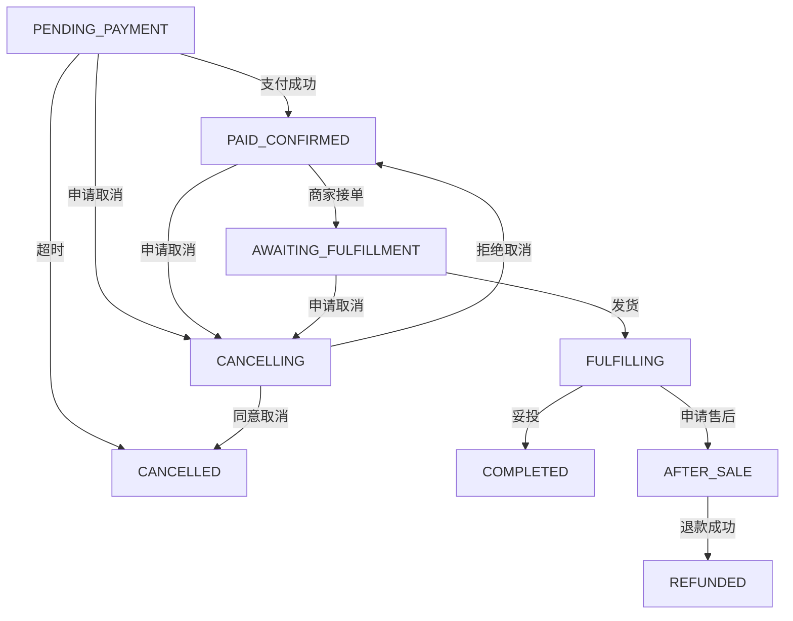
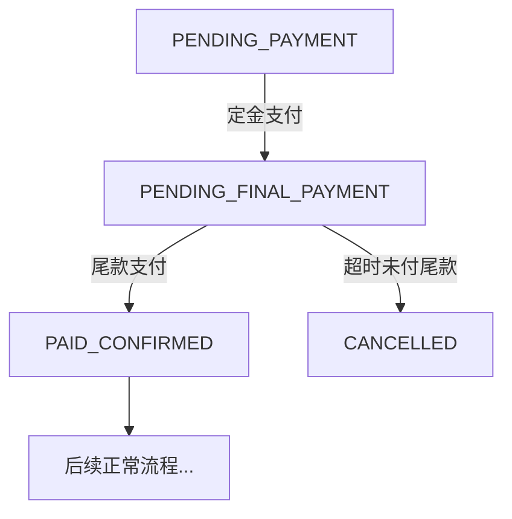

# 订单主流程接口完整实现

本文档描述了订单主流程的完整接口实现，包含用户侧、商家侧、内部回调等所有状态转换接口。

## 接口概览

### 用户侧接口 (`/order/user`)

| 接口路径 | 方法 | 功能 | 状态转换 | 实现状态 |
|---------|------|------|----------|----------|
| `/submit/preview` | POST | 订单预览 | - | ✅ 已存在 |
| `/submit/apply` | POST | 提交订单 | → PENDING_PAYMENT | ✅ 已存在 |
| `/cancel/preview` | POST | 取消预览 | - | ✅ 已存在 |
| `/cancel/apply` | POST | 申请取消 | → CANCELLING | ✅ 已存在 |
| `/confirm-receipt` | POST | 确认收货 | FULFILLING → COMPLETED | ✅ 新增 |
| `/after-sale/apply` | POST | 申请售后 | FULFILLING/COMPLETED → AFTER_SALE | ✅ 新增 |
| `/complete/preview` | POST | 完成预览 | - | ✅ 新增 |

### 商家侧接口 (`/order/merchant`)

| 接口路径 | 方法 | 功能 | 状态转换 | 实现状态 |
|---------|------|------|----------|----------|
| `/order/receive` | POST | 商家接单 | PAID_CONFIRMED → AWAITING_FULFILLMENT | ✅ 完善 |
| `/ship` | POST | 商家发货 | AWAITING_FULFILLMENT → FULFILLING | ✅ 完善 |
| `/cancel/approve` | POST | 同意取消 | CANCELLING → CANCELLED | ✅ 完善 |
| `/cancel/reject` | POST | 拒绝取消 | CANCELLING → previous | ✅ 完善 |
| `/delivery/confirm` | POST | 确认妥投 | FULFILLING → COMPLETED | ✅ 新增 |

### 内部接口 (`/order/internal`)

| 接口路径 | 方法 | 功能 | 状态转换 | 实现状态 |
|---------|------|------|----------|----------|
| `/payment/success` | POST | 支付成功回调 | PENDING_PAYMENT → PAID_CONFIRMED | ✅ 新增 |
| `/logistics/picked` | POST | 物流揽收 | - | ✅ 新增 |
| `/logistics/delivered` | POST | 物流妥投 | FULFILLING → COMPLETED | ✅ 新增 |
| `/refund/success` | POST | 退款成功 | AFTER_SALE/CANCELLING → REFUNDED | ✅ 新增 |
| `/timeout/unpaid-cancel` | POST | 超时取消 | PENDING_PAYMENT → CANCELLED | ✅ 新增 |
| `/auto/complete` | POST | 自动完成 | FULFILLING → COMPLETED | ✅ 新增 |
| `/auto/await-fulfillment` | POST | 转待履约 | PAID_CONFIRMED → AWAITING_FULFILLMENT | ✅ 新增 |

## 请求/响应协议

### 通用响应格式

```json
{
  "code": 200,
  "message": "success",
  "data": {
    "status": "success",
    "message": "操作成功",
    "traceId": "uuid"
  }
}
```

### 关键请求DTO示例

#### 1. 确认收货请求
```json
{
  "orderId": "uuid",
  "idempotencyKey": "unique-key",
  "remark": "商品完好"
}
```

#### 2. 售后申请请求
```json
{
  "orderId": "uuid",
  "type": "REFUND|RETURN_REFUND|EXCHANGE",
  "reasonCode": "QUALITY_ISSUE",
  "amount": 100.00,
  "items": [
    {
      "skuId": "sku123",
      "quantity": 1,
      "amount": 50.00
    }
  ],
  "idempotencyKey": "unique-key",
  "remark": "商品有质量问题"
}
```

#### 3. 支付成功回调
```json
{
  "orderId": "uuid",
  "payType": "DEPOSIT|FINAL|FULL",
  "payAmount": 299.00,
  "paidAt": 1695369600000,
  "eventId": "payment-event-123",
  "paymentId": "pay-123456"
}
```

#### 4. 商家发货请求
```json
{
  "orderId": "uuid",
  "logistics": {
    "companyCode": "SF",
    "trackingNo": "SF1234567890",
    "companyName": "顺丰速运"
  },
  "items": [
    {
      "skuId": "sku123",
      "quantity": 2
    }
  ],
  "operatorId": "merchant-001",
  "idempotencyKey": "unique-key"
}
```

## 状态机映射

### 核心状态流转



### 预售流程



## 幂等与安全

### 幂等控制

1. **用户操作**：使用 `idempotencyKey` 字段
2. **外部回调**：使用 `eventId` 字段
3. **作用域隔离**：按接口路径分组

### 签名校验

内部回调接口需要进行签名校验：

```http
POST /order/internal/payment/success
X-Signature: HMAC-SHA256(body, secret)
X-Timestamp: 1695369600
Content-Type: application/json
```

## 错误码

| 错误码 | 说明 | 场景 |
|--------|------|------|
| 400 | 参数错误 | 请求参数不合法 |
| 401 | 未授权 | 签名校验失败 |
| 403 | 权限不足 | 商家操作他人订单 |
| 404 | 订单不存在 | 订单ID无效 |
| 409 | 状态冲突 | 非法状态转换 |
| 422 | 业务不可达 | 库存不足等业务限制 |
| 500 | 系统错误 | 内部服务异常 |

## 实现架构

### 分层结构

```
interfaces/rest/          # REST控制器层
├── UserOrderController   # 用户侧接口
├── MerchantOrderController # 商家侧接口
└── InternalOrderController # 内部回调接口

interfaces/dto/request/   # 请求DTO
├── ConfirmReceiptRequest
├── AfterSaleApplyRequest
├── PaymentSuccessRequest
└── ...

application/command/      # 应用命令
├── ConfirmReceiptCommand
├── AfterSaleApplyCommand
├── PaymentSuccessCommand
└── ...

application/service/      # 应用服务
└── OrderApplicationService # 订单应用服务

domain/status/           # 状态机
└── OrderStateTransitionService # 状态转换服务

domain/service/          # 领域服务
├── IdempotencyService   # 幂等服务
├── CallbackEventService # 回调事件服务
└── OrderDomainService   # 订单领域服务
```

### 关键组件

1. **状态机服务** (`OrderStateTransitionService`)
   - 纯函数式状态转换
   - 支持所有业务场景的状态流转
   - 包含详细的接口映射文档

2. **幂等服务** (`IdempotencyService`)
   - 支持按作用域的幂等控制
   - TTL过期机制
   - 重复请求检测

3. **回调事件服务** (`CallbackEventService`)
   - 外部回调的幂等处理
   - 事件去重机制
   - 支持多来源事件

4. **应用服务** (`OrderApplicationService`)
   - 完整的订单流程方法
   - 状态机集成
   - 事件发布机制

## 部署与监控

### 接口监控指标

- 接口调用量和成功率
- 状态转换成功率
- 幂等重复请求比例
- 回调处理延迟

### 告警规则

- 状态转换失败率 > 1%
- 回调处理延迟 > 5s
- 幂等冲突率 > 5%
- 订单长时间停留在中间状态

## 测试策略

### 单元测试

- 状态机转换逻辑
- 幂等控制机制
- 参数校验规则

### 集成测试

- 完整订单流程
- 异常场景处理
- 并发状态更新

### 契约测试

- 外部回调接口
- 签名校验机制
- 幂等行为验证

---

**注意**：当前实现为接口框架和占位实现，具体的业务逻辑、数据库操作、消息发布等需要根据实际业务需求进一步完善。