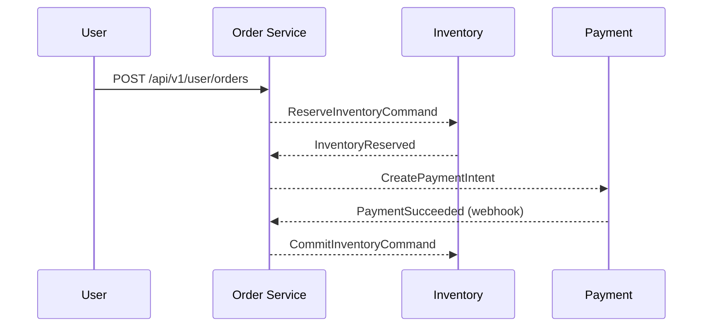

# 订单服务 (tinystore-domain-order)

本服务提供订单的写模型与事件源处理，负责从创建到完成/取消的主流程推进；读模型通过投影提供订单汇总与时间线查询。

## 我是谁 / 依赖 / 事件产出 / SLO
- 我是谁：订单域服务（ES + CQRS 写侧），状态机以 CoreFlowStatus 为准
- 依赖：Kafka（事件）、PostgreSQL（events/snapshots/投影）、Redis（幂等与缓存，可选）
- 事件：`order.events`（源流），对外由投影/下游消费
- SLO（示例）：下单接口 p95 < 300ms（不含支付跳转）

## 快速时序


## API 使用指南

### 创建订单（新模型）
```java
// 使用新的权威数据来源
CreateOrderArgs args = CreateOrderArgs.builder()
    .buyer(Buyer.of("buyer-123"))
    .subOrders(List.of(
        SubOrder.builder()
            .shopId("shop-1")
            .lines(List.of(
                LineItem.createSimple(
                    LineId.generate(),
                    SkuSnapshot.of("sku-1", "商品A", Money.ofCents(1000)),
                    3
                ),
                LineItem.createComposite(  // 套装
                    LineId.generate(),
                    SkuSnapshot.of("combo-1", "套装A", Money.ofCents(2000)),
                    1,
                    List.of(
                        LineItem.createComponent(
                            LineId.generate(),
                            SkuSnapshot.of("sku-2", "组件1", Money.ofCents(800)),
                            1
                        )
                    )
                )
            ))
            .address(fulfillmentAddress)
            .build()
    ))
    .address(displayAddress)  // 非权威，仅展示
    .build();

Order order = Order.create(args);
```

### 行级售后申请
```java
ApplyAfterSaleCommand command = ApplyAfterSaleCommand.builder()
    .orderId("order-123")
    .applicantId("buyer-456")
    .caseType(AfterSaleCaseType.REFUND)
    .scope(AfterSaleScope.LINE)
    .items(List.of(
        Item.builder()
            .lineId("line-123")
            .requestedQty(2)
            .reasonCode("QUALITY_ISSUE")
            .reasonText("商品质量问题")
            .build()
    ))
    .evidenceUrls(List.of("https://example.com/evidence.jpg"))
    .pickupInfo(PickupInfo.builder()
        .needPickup(true)
        .contactName("张三")
        .contactPhone("13800138000")
        .address("北京市朝阳区...")
        .build())
    .idempotencyKey("key-789")
    .build();
```

### 金额计算示例
```java
// 安全的金额运算
Money lineTotal = Money.ofCents(1000);  // 10.00元
Money lineDiscount = Money.ofCents(200); // 2.00元
Money linePayable = lineTotal.subtract(lineDiscount); // 8.00元

// 货币一致性检查（自动抛异常）
Money cnyAmount = Money.ofCents(1000, Currency.CNY);
Money usdAmount = Money.ofCents(100, Currency.USD);
// Money result = cnyAmount.add(usdAmount); // 抛出 OrderDomainException
```

## 幂等与事件
- 请求幂等：`X-Idempotency-Key`；内部映射 `commandId`
- 回调幂等：支付回调以 `deliveryId/channel` 消重
- 事件信封：[见这里](../doc/messaging/event-envelope.md)

## 读模型与查询
- `order_summary`：列表/筛选/分页（见 `../doc/readmodels/order-summary.md`）
- `order_timeline`：订单状态时间轴（见 `../doc/readmodels/order-timeline.md`）

## 可观测与运维
- 指标：`projection_lag`, `consumer_lag` 等（见 `../doc/operations/observability.md`）
- Runbooks：消费者积压、DLQ 回放、Webhook 风暴（见 `../doc/operations/runbooks/*`）

## 迁移指南

### 废弃字段处理
```java
// ❌ 旧代码 - 已废弃
Order order = ...;
List<OrderProduct> products = order.getProducts(); // @Deprecated

// ✅ 新代码 - 使用权威数据源
List<LineItem> lines = order.getSubOrders().stream()
    .flatMap(sub -> sub.getLines().stream())
    .collect(toList());
```

### OrderLine 迁移到 LineItem
```java
// ❌ 旧模型
OrderLine oldLine = OrderLine.builder()
    .productId("sku-1")
    .price(BigDecimal.valueOf(10.00))
    .quantity(2)
    .build();

// ✅ 新模型
LineItem newLine = LineItem.createSimple(
    LineId.generate(),
    SkuSnapshot.of("sku-1", "商品名称", Money.ofCents(1000)),
    2
);
```

### API 接口

### 用户接口
- `POST /api/v1/user/orders` - 创建订单
- `POST /api/v1/user/orders/{id}/cancel` - 取消订单
- `POST /api/v1/user/orders/{id}/confirm` - 确认收货
- `POST /api/v1/user/orders/{id}/after-sale` - 申请售后（新）

### 商家接口  
- `POST /api/v1/merchant/orders/{id}/accept` - 接受订单
- `POST /api/v1/merchant/orders/{id}/ship` - 发货
- `POST /api/v1/merchant/orders/{id}/delivered` - 确认妥投

### 内部回调
- `POST /api/v1/internal/orders/payment-success` - 支付成功回调
- `POST /api/v1/internal/orders/logistics-pickup` - 物流揽收回调
- `POST /api/v1/internal/orders/logistics-delivered` - 物流妥投回调

## 快速开始

### 创建订单示例

```bash
curl -X POST "http://localhost:8080/api/v1/user/orders" \
  -H "Content-Type: application/json" \
  -H "X-Idempotency-Key: user_12345_create_$(date +%s)" \
  -H "X-Correlation-ID: $(uuidgen)" \
  -d '{
    "products": [
      {
        "skuId": "sku_001",
        "quantity": 1,
        "price": 99.99
      }
    ],
    "deliveryAddress": {
      "province": "北京",
      "city": "北京市", 
      "district": "朝阳区",
      "detail": "xxx街道xxx号"
    }
  }'
```

### 状态查询
订单状态会自动同步到相关系统，可通过事件订阅或 API 查询获取最新状态。

## 领域与架构参考
- 订单域分册：`../doc/domain/order-es.md`
- 状态映射：`../doc/domain/order-payment-inventory-status-mapping.md`
- Saga 编排：`../doc/architecture/saga-checkout.md`

## 配置说明

### 幂等性配置
```yaml
order:
  idempotency:
    enabled: true
    cache-duration: PT24H  # 24小时
    redis-key-prefix: "order:idempotency:"
```

### 事件发布配置
```yaml
order:
  outbox:
    enabled: true
    batch-size: 100
    retry-max-attempts: 3
    cleanup-schedule: "0 2 * * *"  # 每天凌晨2点清理
```

## 监控和度量

### 关键指标
- 订单创建成功率
- 状态转换延迟  
- 幂等性命中率
- 事件发布成功率

### 健康检查
- `/actuator/health` - 服务健康状态
- `/actuator/metrics` - 业务指标
- `/actuator/info` - 服务信息

## 开发指南

详细的开发文档请参考：
- [API 使用指南](../doc/order/api-usage-guide.md)
- [状态机设计](../doc/order/state-machine-design.md)  
- [状态迁移说明](../doc/order/order-status-migration.md)

商城项目的订单服务是核心业务模块，需覆盖**正向订单流程、逆向售后流程、订单管理、数据支撑**四大维度，具体功能如下：


### 一、正向订单核心功能（从创建到完成）
1. **订单创建**
    - 支持用户提交购物车商品生成订单，自动计算商品金额、优惠（满减/优惠券/积分抵扣）、运费、实付金额。
    - 校验库存（预占库存，避免超卖）、用户地址有效性、支付方式可用性。
    - 生成唯一订单号（需保证不重复，可结合时间戳+用户ID+随机数设计）。

2. **订单支付**
    - 对接多支付渠道（微信支付、支付宝、银行卡等），提供支付链接/二维码生成能力。
    - 接收支付渠道的回调通知，同步订单支付状态（如“待支付”→“支付成功”“支付失败”）。
    - 处理支付超时逻辑（超时未支付自动取消订单，并释放预占库存）。

3. **订单履约**
    - 商家端：支持商家查看待处理订单，操作“确认发货”（录入物流单号、选择物流公司），同步订单状态为“已发货”。
    - 物流跟踪：对接物流接口，实时拉取物流信息（如运输中、已到达、待签收），同步至订单详情，供用户查看。
    - 签收确认：支持用户手动确认收货，或物流显示“已签收”后自动同步订单状态为“已签收”。


### 二、逆向售后功能（退货/退款/取消）
1. **订单取消**
    - 用户端：待支付订单可直接取消；已支付未发货订单可申请取消，需商家审核；已发货订单取消需先发起退货。
    - 商家端：支持审核用户的取消申请，同意后自动触发退款（已支付订单），并释放库存。

2. **退款管理**
    - 支持“仅退款”（如未发货、少发漏发）和“退货后退款”（如商品质量问题）两种场景。
    - 用户端：提交退款申请（选择理由、上传凭证）；查看退款进度。
    - 商家端：审核退款申请，同意后触发退款流程；对接支付渠道完成退款打款，同步订单状态为“退款成功”。
    - 异常处理：支持退款失败重试、退款金额校验（避免超额退款）。

3. **退货管理**
    - 用户端：退款申请通过后，填写退货物流单号；查看商家验收进度。
    - 商家端：收到退货后操作“验收”（通过/拒绝），验收通过后触发退款；验收拒绝需填写理由并通知用户。


### 三、订单管理功能（用户端+商家端+admin端）
1. **用户端订单管理**
    - 订单列表：按状态筛选（全部/待支付/待发货/待签收/已完成/售后中）；按时间排序（最新/最早）。
    - 订单详情：展示商品信息、金额明细、支付信息、物流信息、售后进度。
    - 操作入口：待支付订单的“去支付”“取消订单”；待签收订单的“查看物流”“确认收货”；支持订单分享、发票申请。

2. **商家端订单管理**
    - 订单处理：待发货订单的“确认发货”；待审核订单（取消/退款/退货）的审核操作。
    - 订单筛选：按订单号、用户ID、时间范围、支付方式等多维度筛选，便于高效处理。
    - 批量操作：支持批量发货、批量导出订单数据（用于对账、发货单打印）。

3. **Admin端订单管理**
    - 全局订单监控：查看所有商家的订单数据，监控异常订单（如支付成功但库存不足、退款超时）。
    - 订单干预：支持手动调整订单状态（如解决系统同步异常）、处理用户投诉订单。
    - 数据统计：按时间/地区/商家维度统计订单量、交易额、售后率，生成报表。


### 四、辅助支撑功能
1. **库存与数据同步**
    - 订单创建时预占库存，取消/退款时释放库存，确保库存准确性。
    - 同步订单数据至财务系统（用于对账）、CRM系统（用于用户消费行为分析）。

2. **消息通知**
    - 自动触发短信/APP推送/公众号消息，告知用户订单状态变更（如支付成功、发货、退款到账）。
    - 商家通知：新订单提醒、待审核售后提醒、退款成功提醒。

3. **订单归档与查询**
    - 对历史订单（如超过3个月）进行归档，提升当前订单列表的查询效率。
    - 支持按订单号、手机号精准查询历史订单，满足用户售后追溯和商家对账需求。

4. **合规与风控**
    - 订单金额、支付方式校验，防止恶意下单（如重复下单、虚假支付）。
    - 保存订单相关凭证（支付记录、物流记录、售后凭证），满足合规审计要求。
